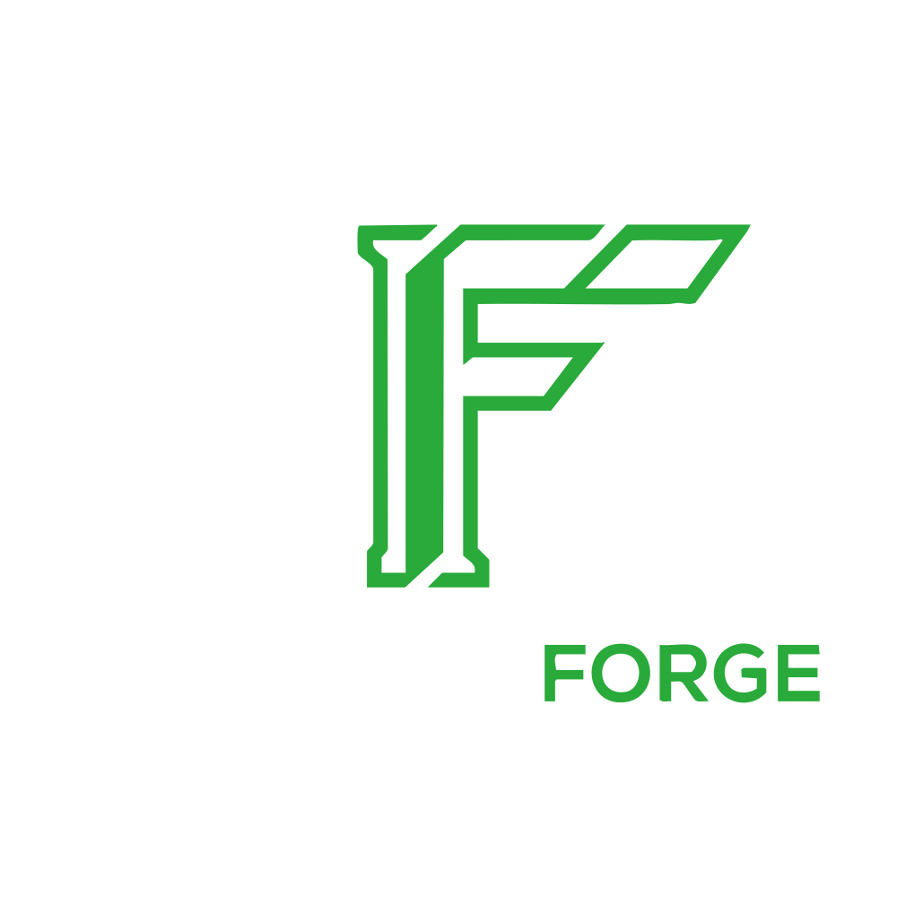
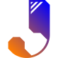
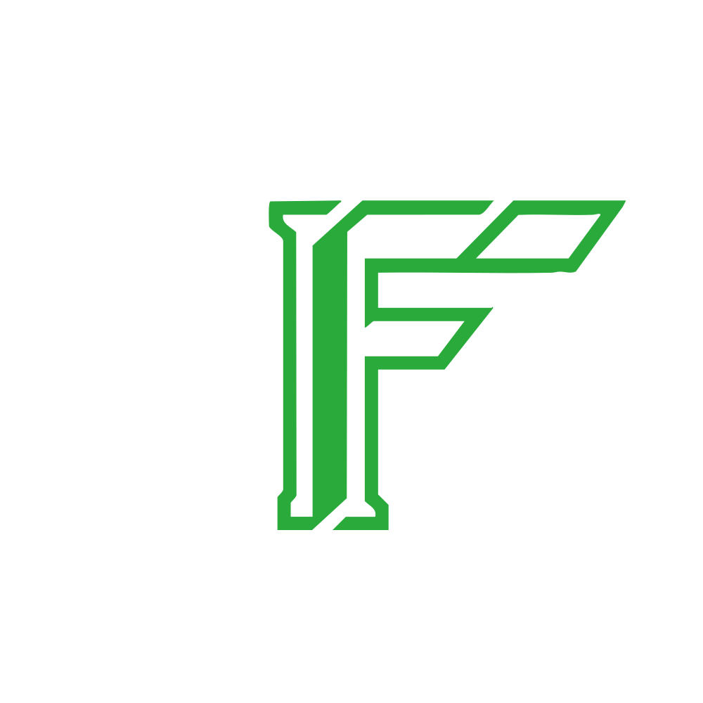

<div align="center">
  

  <h3>Turn two reviewed 2D profiles into a parametric transition adapter.</h3>

  <p>
    InterfaceForge is a guided adapter-design workflow for creating hollow transitions between clean circular, rectangular, and rounded-rectangular interfaces.
  </p>

  <p>
    <a href="https://github.com/joravarsinghing/InterfaceForge">
      
    </a>
    <a href="LICENSE">
      
    </a>
    
    
    
    
    
  </p>
</div>

---

## Overview

InterfaceForge creates a hollow parametric transition between two reviewed planar interface profiles.

The controlled submission workflow demonstrates a practical dust-extraction adapter:

<table>
  <tr>
    <td width="33%" valign="top">
      <strong>Interface A</strong><br><br>
      Circular vacuum-hose profile
    </td>
    <td width="33%" valign="top">
      <strong>Interface B</strong><br><br>
      Rounded-rectangle CNC dust-port profile
    </td>
    <td width="33%" valign="top">
      <strong>Result</strong><br><br>
      Zoo-generated hollow transition adapter
    </td>
  </tr>
</table>

InterfaceForge guides the user through:

- uploading each clean profile;
- calibrating it using two selected points and a known real-world distance;
- reviewing and approving the detected geometry;
- configuring adapter length, wall thickness, clearances, offsets, and angle;
- compiling deterministic KCL;
- generating the model through Zoo Engine;
- revising approved parameters through Zoo Agent;
- exporting STL, STEP, and KCL artifacts.

> InterfaceForge produces **user-reviewed design candidates**. It does not claim unrestricted photo-to-CAD reconstruction, automatic perspective correction, or certified manufacturing readiness.

---

## Product preview

<!-- Replace this placeholder with the final wide application screenshot or demo GIF. -->

<div align="center">

**[PLACEHOLDER — Wide application screenshot or GIF showing upload → calibration → approval → generation → export]**

</div>

<table>
  <tr>
    <td width="50%" valign="top">
      <h3>Input</h3>
      <p>Two clean, front-facing, filled 2D profiles with proportions already preserved.</p>
    </td>
    <td width="50%" valign="top">
      <h3>Output</h3>
      <p>A reviewed parametric adapter with deterministic KCL and Zoo-generated STL and STEP exports.</p>
    </td>
  </tr>
</table>

---

# User workflows

## Workflow 1 — Create an adapter from start to finish

This is the primary guided workflow.

---

### Step 1 — Upload Interface A

Upload the first clean profile.

For the controlled demo, Interface A is a **solid circular profile representing the vacuum-hose opening**.

The image should be:

- front-facing;
- filled;
- high contrast;
- free of dimensions and annotations;
- fully visible;
- proportionally accurate.

<div align="center">

**[PLACEHOLDER — Screenshot: Step 1 upload page with circular Interface A image selected]**

</div>

After upload, InterfaceForge validates the file and begins profile analysis.

---

### Step 2 — Calibrate and approve Interface A

InterfaceForge displays the detected profile together with the source image.

The user:

1. selects two points on the image;
2. enters the known real-world distance between them;
3. confirms the scale;
4. reviews the detected profile and dimensions;
5. approves Interface A.

Two-point calibration establishes the pixel-to-millimetre scale.

It does not correct perspective distortion or repair an incorrect source image.

<div align="center">

**[PLACEHOLDER — Screenshot: circular profile review with two calibration points and confirmed diameter]**

</div>

Interface B remains locked until Interface A is approved.

---

### Step 3 — Upload, calibrate, and approve Interface B

Upload the second clean profile.

For the controlled demo, Interface B is a **solid rounded-rectangle profile representing the CNC dust-port opening**.

The same review process is repeated:

1. upload the image;
2. inspect the detected primitive;
3. select two calibration points;
4. enter the known real-world distance;
5. confirm scale;
6. approve Interface B.

<div align="center">

**[PLACEHOLDER — Screenshot: rounded-rectangle Interface B upload and profile review]**

</div>

---

### Step 4 — Configure the connection

After both interfaces are approved, configure the transition.

Available parameters include:

- connection mode;
- adapter length;
- wall thickness;
- Interface A clearance;
- Interface B clearance;
- X and Y offset;
- limited transition angle;
- manufacturing-related constraints.

InterfaceForge validates these parameters before generation.

<div align="center">

**[PLACEHOLDER — Screenshot: connection configuration page with length, wall thickness, and clearance controls]**

</div>

Supported connection modes include:

<table>
  <tr>
    <th align="left">Mode</th>
    <th align="left">Description</th>
  </tr>
  <tr>
    <td><strong>Coaxial</strong></td>
    <td>Both interfaces share the same central axis.</td>
  </tr>
  <tr>
    <td><strong>Offset</strong></td>
    <td>The second interface is displaced in X and/or Y.</td>
  </tr>
  <tr>
    <td><strong>Limited-angle</strong></td>
    <td>The adapter transitions between interfaces using a controlled angle.</td>
  </tr>
</table>

---

### Step 5 — Generate, inspect, and export

InterfaceForge:

1. validates the approved project schema;
2. compiles deterministic KCL;
3. submits the model to Zoo Engine;
4. tracks the generation job;
5. displays the generated result;
6. prepares STL, STEP, and KCL exports.

<div align="center">

**[PLACEHOLDER — Screenshot: Zoo-generated circular-to-rounded-rectangle adapter in the final result viewer]**

</div>

Available downloads:

<table>
  <tr>
    <th align="left">Format</th>
    <th align="left">Purpose</th>
  </tr>
  <tr>
    <td><strong>KCL</strong></td>
    <td>Editable parametric source used to generate the model.</td>
  </tr>
  <tr>
    <td><strong>STL</strong></td>
    <td>Mesh output for slicing, visualization, and 3D printing.</td>
  </tr>
  <tr>
    <td><strong>STEP</strong></td>
    <td>Solid CAD exchange format for downstream engineering tools.</td>
  </tr>
</table>

Exports remain tied to the current model revision.

If an upstream parameter changes, the existing model becomes stale and must be regenerated before current exports are available.

---

## Workflow 2 — Edit the generated adapter using AI chat

After reaching **Step 5**, the user can request supported parameter changes through the chat-based revision panel.

Example requests:

```text
Make the adapter 10 mm longer.
````

```text
Increase the wall thickness to 3 mm.
```

```text
Move the outlet 5 mm to the right.
```

```text
Increase the clearance on Interface A.
```

### AI editing sequence

1. The user enters a natural-language revision request.
2. Zoo Agent interprets the requested parameter change.
3. InterfaceForge compares the proposed values against the current project.
4. Server-side validation checks that only approved parameters are being changed.
5. The user reviews the before-and-after values.
6. The proposal remains unapplied until explicitly confirmed.
7. After confirmation, InterfaceForge updates the canonical schema.
8. KCL is recompiled.
9. Zoo Engine regenerates the adapter.
10. Revised STL, STEP, and KCL exports become available.

<div align="center">

**[PLACEHOLDER — Screenshot: AI revision chat with “Make it 10 mm longer” entered]**

</div>

<div align="center">

**[PLACEHOLDER — Screenshot: before-and-after proposal table with Confirm and Cancel actions]**

</div>

<div align="center">

**[PLACEHOLDER — Screenshot: regenerated adapter with updated length and revised exports]**

</div>

### Revision safeguards

Zoo Agent does not have unrestricted access to the project.

The revision workflow is restricted by:

* a server-side parameter allowlist;
* engineering and manufacturing validation;
* explicit user confirmation;
* model revision tracking;
* stale-export protection;
* last-known-good model preservation.

The chat workflow cannot directly modify:

* approved profile contours;
* uploaded source images;
* project authorization;
* provider settings;
* export provenance.

If regeneration fails, the previous successful model remains available as the last-known-good revision.

---

## Supported profile scope

The submission build supports primitive profiles for final adapter generation.

<table>
  <tr>
    <th align="left">Profile type</th>
    <th align="left">Review</th>
    <th align="left">Final generation</th>
  </tr>
  <tr>
    <td><strong>Circle</strong></td>
    <td>Supported</td>
    <td>Supported</td>
  </tr>
  <tr>
    <td><strong>Rectangle</strong></td>
    <td>Supported</td>
    <td>Supported</td>
  </tr>
  <tr>
    <td><strong>Rounded rectangle</strong></td>
    <td>Supported</td>
    <td>Supported</td>
  </tr>
  <tr>
    <td><strong>Arbitrary traced closed profile</strong></td>
    <td>Experimental</td>
    <td>Not supported in the submission build</td>
  </tr>
</table>

The controlled demo intentionally uses a circle and a rounded rectangle because that path is bounded, reviewable, and compatible with deterministic Zoo generation.

---

## Input requirements

The reliable workflow uses a **clean, filled 2D profile image**.

<table>
  <tr>
    <th align="left">Requirement</th>
    <th align="left">Guidance</th>
  </tr>
  <tr>
    <td><strong>One profile only</strong></td>
    <td>Use a single front-facing or orthographic profile.</td>
  </tr>
  <tr>
    <td><strong>Filled shape</strong></td>
    <td>Use a solid silhouette instead of a thin outline.</td>
  </tr>
  <tr>
    <td><strong>Plain background</strong></td>
    <td>Maintain strong contrast between the profile and background.</td>
  </tr>
  <tr>
    <td><strong>No annotations</strong></td>
    <td>Remove dimensions, arrows, leaders, text, and center marks.</td>
  </tr>
  <tr>
    <td><strong>Complete boundary</strong></td>
    <td>Keep the full uncropped profile visible.</td>
  </tr>
  <tr>
    <td><strong>Preserved proportions</strong></td>
    <td>The source must not contain camera-angle or perspective distortion.</td>
  </tr>
  <tr>
    <td><strong>Known reference distance</strong></td>
    <td>The user must know the real distance between two selectable image points.</td>
  </tr>
</table>

<table>
  <tr>
    <td width="50%" align="center" valign="top">
      <strong>Interface A — Recommended circular input</strong><br><br>
      [PLACEHOLDER — Solid filled circular profile image]
    </td>
    <td width="50%" align="center" valign="top">
      <strong>Interface B — Recommended rounded-rectangle input</strong><br><br>
      [PLACEHOLDER — Solid filled rounded-rectangle profile image]
    </td>
  </tr>
</table>

### Why ordinary photographs are unreliable

Two-point calibration applies a uniform scale to the detected profile.

It cannot correct:

* perspective distortion;
* camera tilt;
* lens distortion;
* an interface face positioned at an angle;
* missing or obscured edges;
* proportions already changed in the source image.

For that reason, InterfaceForge expects a prepared planar profile, scan, silhouette, or orthographic representation rather than an unrestricted phone photograph.

### Why dimensioned drawings are experimental

Dimension lines, arrows, leaders, extension lines, center marks, and text may be detected as geometry during classical image processing.

They can introduce:

* false cuts;
* false extensions;
* additional closed regions;
* incorrect contour selection.

Dimensioned drawings and arbitrary traced profiles remain experimental in the submission build.

---

## Why InterfaceForge exists beside Zoo Design Studio

InterfaceForge does not attempt to replace Zoo Design Studio.

It provides a constrained, adapter-specific workflow around Zoo Engine and Zoo Agent.

<table>
  <tr>
    <th align="left">InterfaceForge responsibility</th>
    <th align="left">Zoo responsibility</th>
  </tr>
  <tr>
    <td>Guided two-interface workflow</td>
    <td>Authoritative CAD execution</td>
  </tr>
  <tr>
    <td>Two-point scale confirmation</td>
    <td>KCL modeling environment</td>
  </tr>
  <tr>
    <td>Mandatory geometry approval</td>
    <td>Parametric model generation</td>
  </tr>
  <tr>
    <td>Adapter-specific parameters and constraints</td>
    <td>Native STL and STEP conversion</td>
  </tr>
  <tr>
    <td>Bounded revision confirmation</td>
    <td>Natural-language revision interpretation</td>
  </tr>
  <tr>
    <td>Model history and stale-export protection</td>
    <td>Zoo Engine and Zoo Agent infrastructure</td>
  </tr>
</table>

---

## Zoo integration

InterfaceForge was built as a **Zoo API Makeathon 2026** entry.

<div align="center">
  <a href="https://zoo.dev/">
    
  </a>
</div>

<br>

<table>
  <tr>
    <td width="50%" valign="top">
      <h3>Zoo Engine API</h3>
      <ul>
        <li>Executes deterministic KCL generated from the approved canonical project schema.</li>
        <li>Produces the authoritative CAD model.</li>
        <li>Generates STL and STEP artifacts associated with the current model revision.</li>
      </ul>
    </td>
    <td width="50%" valign="top">
      <h3>Zoo Agent API</h3>
      <ul>
        <li>Interprets natural-language parameter revision requests.</li>
        <li>Operates behind a strict server-side allowlist.</li>
        <li>Never applies a proposal until the user explicitly confirms it.</li>
      </ul>
    </td>
  </tr>
</table>

Learn more at [zoo.dev](https://zoo.dev/) and in the project’s [API usage guide](docs/API_USAGE.md).

---

## Core capabilities

* Guided two-interface workflow.
* Session restoration and route protection.
* OpenCV-assisted primitive profile analysis.
* Two-point scale calibration.
* Explicit profile review and approval.
* Circle, rectangle, and rounded-rectangle generation.
* Coaxial, offset, and limited-angle connections.
* Wall-thickness and clearance validation.
* Deterministic KCL compilation.
* Live Zoo Engine generation.
* Bounded chat-based revisions through Zoo Agent.
* Before-and-after revision confirmation.
* Last-known-good model preservation.
* Model and schema revision tracking.
* Stale-export prevention.
* STL, STEP, and KCL exports.
* Mock providers for deterministic offline development and testing.

---

## Architecture

<!-- Replace this placeholder with the final architecture diagram. -->

<div align="center">

**[PLACEHOLDER — Architecture diagram: React → FastAPI → canonical schema → KCL compiler → Zoo Engine / Zoo Agent → exports]**

</div>

<table>
  <tr>
    <th align="left">Layer</th>
    <th align="left">Technology</th>
    <th align="left">Responsibility</th>
  </tr>
  <tr>
    <td><strong>Frontend</strong></td>
    <td>React 18, TypeScript 5, Vite 5, React Router 6</td>
    <td>Guided workflow, calibration, profile approval, generation status, chat revisions, and exports.</td>
  </tr>
  <tr>
    <td><strong>Backend</strong></td>
    <td>Python 3.14, FastAPI, Pydantic 2, Pydantic Settings, Uvicorn</td>
    <td>Workflow invariants, validation, profile analysis, KCL generation, provider orchestration, and exports.</td>
  </tr>
  <tr>
    <td><strong>Persistence</strong></td>
    <td>SQLite</td>
    <td>Canonical project state, schema revisions, model revisions, and last-known-good state.</td>
  </tr>
  <tr>
    <td><strong>Profile analysis</strong></td>
    <td>OpenCV, NumPy, Pillow</td>
    <td>Image validation, primitive recognition, contour analysis, calibration support, and trace diagnostics.</td>
  </tr>
  <tr>
    <td><strong>CAD</strong></td>
    <td>KCL, Zoo Engine API, Zoo Agent API</td>
    <td>Parametric model generation, bounded revisions, and native CAD exports.</td>
  </tr>
  <tr>
    <td><strong>Quality</strong></td>
    <td>Pytest, Ruff, Mypy, Vitest, ESLint, TypeScript</td>
    <td>Backend, frontend, contract, lint, type, and build verification.</td>
  </tr>
</table>

For detailed design information, see:

* [Architecture](docs/ARCHITECTURE.md)
* [Technical design](technical_design.md)
* [API usage](docs/API_USAGE.md)
* [Geometry rules](docs/GEOMETRY_RULES.md)

---

## Local setup

### Prerequisites

* Python 3.14.x.
* Node.js 18 or newer.
* npm 9 or newer.
* Zoo API credentials for live generation and chat-based revisions.

Backend runtime dependencies are declared in [backend/pyproject.toml](backend/pyproject.toml).

### Install

```powershell
# From the repository root
py -3.14 -m venv venv314
.\venv314\Scripts\python.exe -m pip install --upgrade pip
.\venv314\Scripts\python.exe -m pip install -e backend[dev]

cd frontend
npm install
cd ..
```

Create the backend environment file from the included example and add the required Zoo credentials.

### Run frontend and backend together

```powershell
python scripts/start_local.py
```

Open:

* Frontend: `http://localhost:5173`
* Backend: `http://localhost:8000`
* FastAPI documentation: `http://localhost:8000/docs`

### Run services individually

```powershell
python scripts/run_backend.py
python scripts/run_frontend.py
```

---

## Testing and verification

Run the full local verification suite:

```powershell
python scripts/run_all_checks.py
```

Run component suites separately:

```powershell
# Backend
.\venv314\Scripts\python.exe -m pytest backend\tests

# Frontend
cd frontend
npm test
cd ..
```

Live Zoo verification requires valid credentials and should remain separate from deterministic offline checks.

---

## Current limitations

* The reliable input is a clean, front-facing, filled 2D profile.
* Source images must already preserve their proportions.
* Two-point calibration establishes scale but does not correct perspective distortion.
* Circle, rectangle, and rounded rectangle are supported for final adapter generation.
* Arbitrary traced closed profiles remain experimental and cannot generate final adapters in the submission build.
* Dimensioned engineering drawings may introduce false geometry.
* Annotation-heavy drawings are outside the reliable submission workflow.
* Threads, mounting holes, countersinks, dovetails, undercuts, and multi-depth interfaces are outside the current scope.
* Camera and tripod mounting systems are not supported use cases.
* Scale and detected geometry require explicit user confirmation.
* Generated adapters are user-reviewed engineering candidates, not certified products.

See [docs/BUGS_AND_LIMITATIONS.md](docs/BUGS_AND_LIMITATIONS.md) for the maintained limitation log.

---

## Documentation

<table>
  <tr>
    <th align="left">Document</th>
    <th align="left">Purpose</th>
  </tr>
  <tr>
    <td><a href="InterfaceForge_PRD_v0.1.md">Product requirements</a></td>
    <td>Product scope, users, requirements, and success criteria.</td>
  </tr>
  <tr>
    <td><a href="docs/ARCHITECTURE.md">Architecture</a></td>
    <td>Current system structure and provider boundaries.</td>
  </tr>
  <tr>
    <td><a href="docs/API_USAGE.md">API usage</a></td>
    <td>Backend contracts and Zoo integration.</td>
  </tr>
  <tr>
    <td><a href="docs/GEOMETRY_RULES.md">Geometry rules</a></td>
    <td>Profile, connection, and manufacturing validation.</td>
  </tr>
  <tr>
    <td><a href="docs/TEST_RESULTS.md">Test results</a></td>
    <td>Recorded verification outcomes.</td>
  </tr>
  <tr>
    <td><a href="docs/BUGS_AND_LIMITATIONS.md">Bugs and limitations</a></td>
    <td>Known issues, experimental paths, and product boundaries.</td>
  </tr>
</table>

Additional technical and development documentation is available throughout the repository.

---

## Credits and license

InterfaceForge is available under the [MIT License](LICENSE).

InterfaceForge is an independent Zoo API Makeathon project and is not an official Zoo product.

<div align="center">

  <h3>Powered by</h3>

  <a href="https://zoo.dev/">
    
  </a>

  <p>
    Zoo Engine, KCL tooling, native CAD exports, and bounded natural-language revision capabilities.
  </p>

  <br>

  <h3>Built by</h3>

  <a href="https://joravarsinghing.github.io/portfolio/">
    
  </a>

  <p>
    <strong>
      <a href="https://joravarsinghing.github.io/portfolio/">Joravar Singh</a>
    </strong><br>
    Product concept, engineering direction, implementation coordination, testing, and submission development.
  </p>

  <br>

  

  <p>
    <sub>Reviewed geometry. Deterministic CAD. Bounded AI revisions.</sub>
  </p>

</div>
```
