<div align="center">

  

  <br>

  <a href="https://zoo.dev/">
    
  </a>

  <h3>Turn two reviewed 2D profiles into a parametric transition adapter.</h3>

  <p>
    A guided workflow for people who need two mismatched openings to connect—but do not want to model the adapter manually in CAD.
  </p>

  <p>
    <a href="https://interfaceforge.pages.dev/">
      
    </a>
    <a href="https://youtu.be/DTEwl9ofGLk">
      
    </a>
    <a href="https://github.com/joravarsinghing/InterfaceForge">
      
    </a>
    <a href="LICENSE">
      
    </a>
  </p>

  <p>
    
    
    
    
    
  </p>

</div>

---

## Overview

InterfaceForge converts two reviewed, front-facing 2D profiles into a hollow parametric transition adapter.

The user:

1. uploads Interface A;
2. calibrates it using one known real-world distance;
3. reviews and approves the detected profile;
4. repeats the process for Interface B;
5. configures fit, length, wall thickness, clearances, offsets, and interface extensions;
6. generates the model through Zoo Engine;
7. optionally requests bounded revisions through Zoo Agent;
8. exports the current STL and KCL.

<p align="center">
  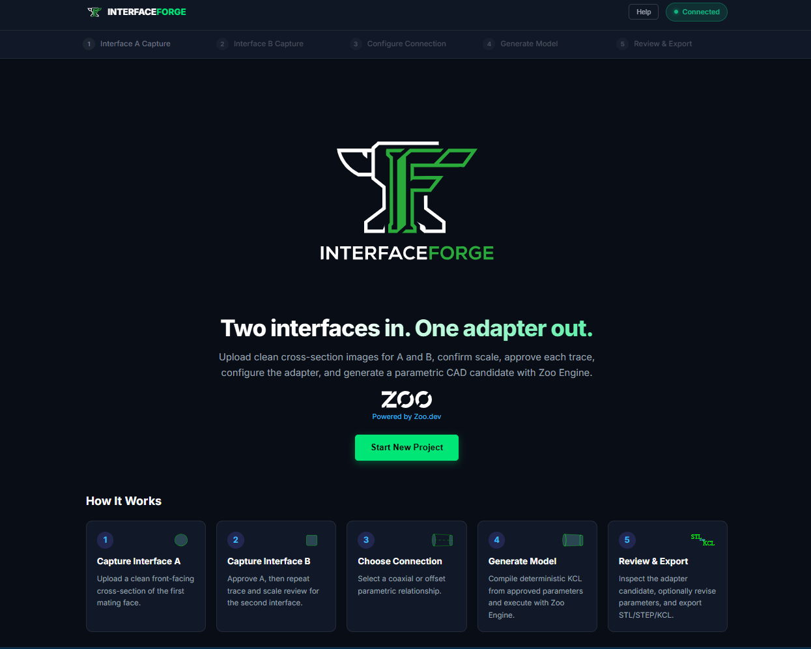
</p>

<table>
  <tr>
    <td width="33%" valign="top">
      <strong>Interface A</strong><br><br>
      Circular vacuum-hose opening
    </td>
    <td width="33%" valign="top">
      <strong>Interface B</strong><br><br>
      Rounded-rectangle dust-port opening
    </td>
    <td width="33%" valign="top">
      <strong>Result</strong><br><br>
      Zoo-generated hollow transition adapter
    </td>
  </tr>
</table>

> InterfaceForge produces **user-reviewed engineering candidates**. It does not claim unrestricted photo-to-CAD reconstruction, certified dimensional accuracy, or manufacturing readiness.

---

## Watch the workflow

<div align="center">
  <a href="https://youtu.be/DTEwl9ofGLk" style="display:inline-block; width:74%;">
    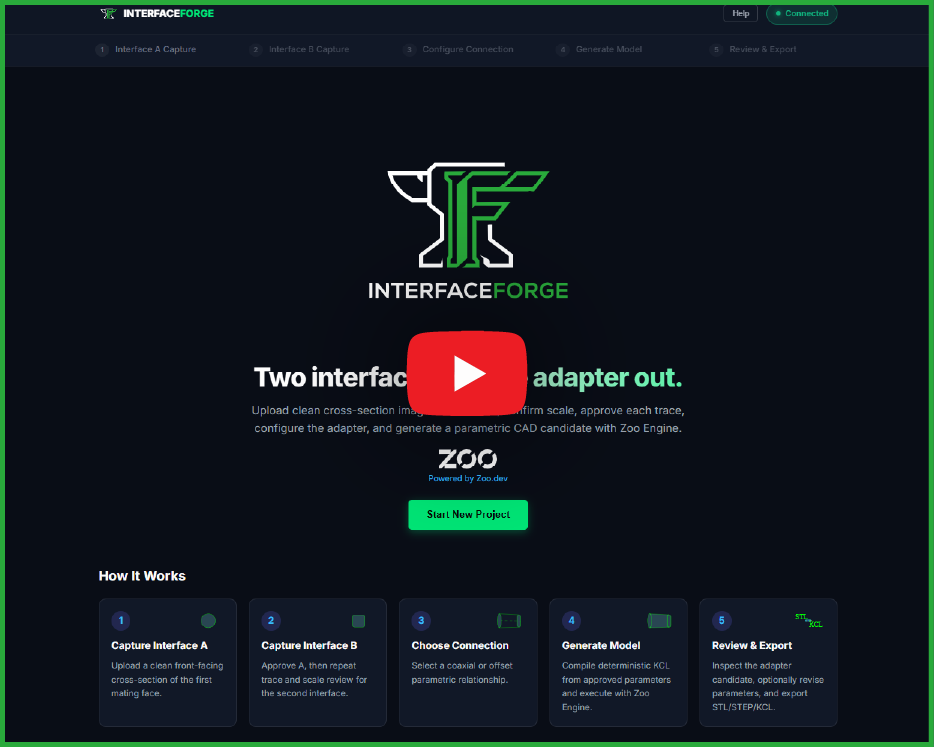
  </a>

  **Click the preview above to watch the full Makeathon demo.**

  The video is unlisted and accessible to anyone with the link.
</div>

---

# How it works

## Workflow 1 — Create an adapter from start to finish

<p align="center">
  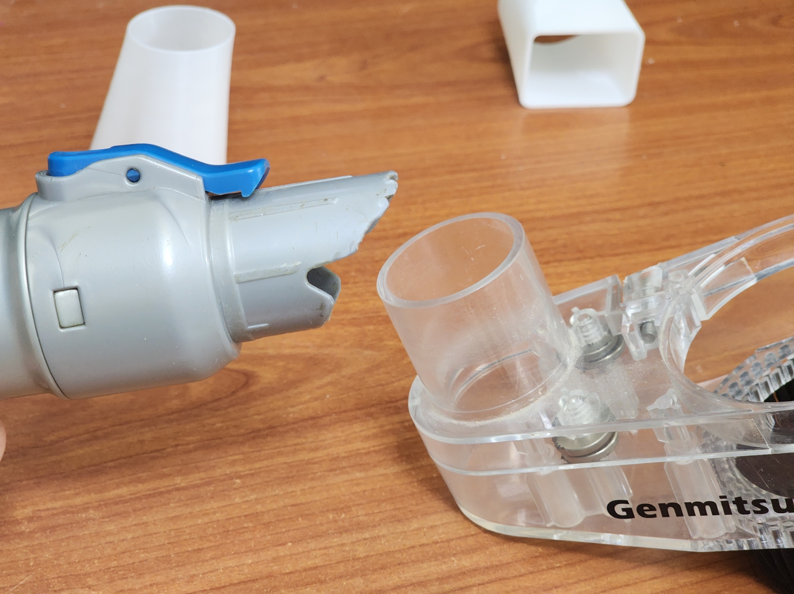
</p>

### Step 1 — Upload Interface A

Upload a clean, front-facing profile representing the first opening.

For the controlled demonstration, Interface A is a filled circular profile representing a vacuum-hose opening.

<p align="center">
  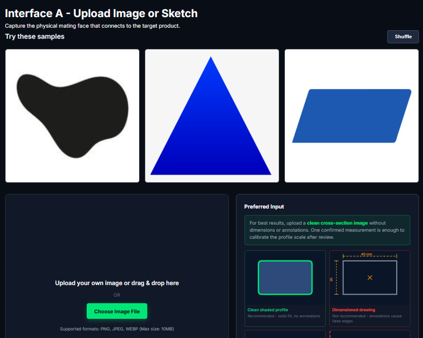
</p>

The reliable input standard is:

- one complete profile;
- dark, filled silhouette;
- solid white background;
- no annotations or dimensions;
- no perspective distortion;
- preserved proportions.

> **Important:** Black and transparent backgrounds are not reliably supported. They may cause the complete image boundary to be detected as a rectangular profile.

---

### Step 2 — Calibrate, review, and approve Interface A

InterfaceForge displays the source image and detected geometry.

The user:

1. selects two points;
2. enters the known real-world distance between them;
3. confirms the scale;
4. reviews the detected profile and dimensions;
5. explicitly approves the interface.

<p align="center">
  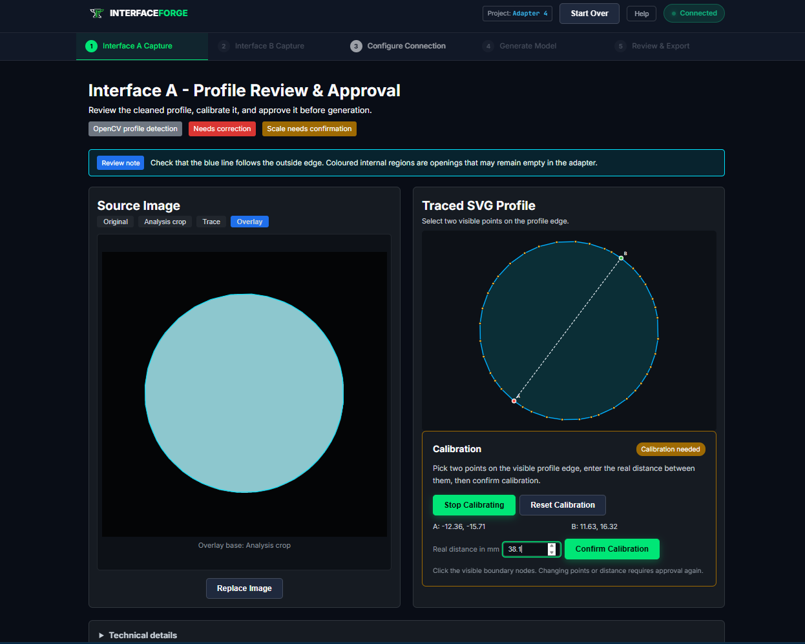
</p>

Two-point calibration establishes the pixel-to-millimetre scale.

It does not correct camera tilt, lens distortion, perspective, hidden edges, or proportions already distorted in the source image.

Interface B remains locked until Interface A is approved.

---

### Step 3 — Repeat for Interface B

The same controlled process is repeated for the second opening.

For the demonstration, Interface B is a rounded-rectangle profile representing a CNC dust port.

<p align="center">
  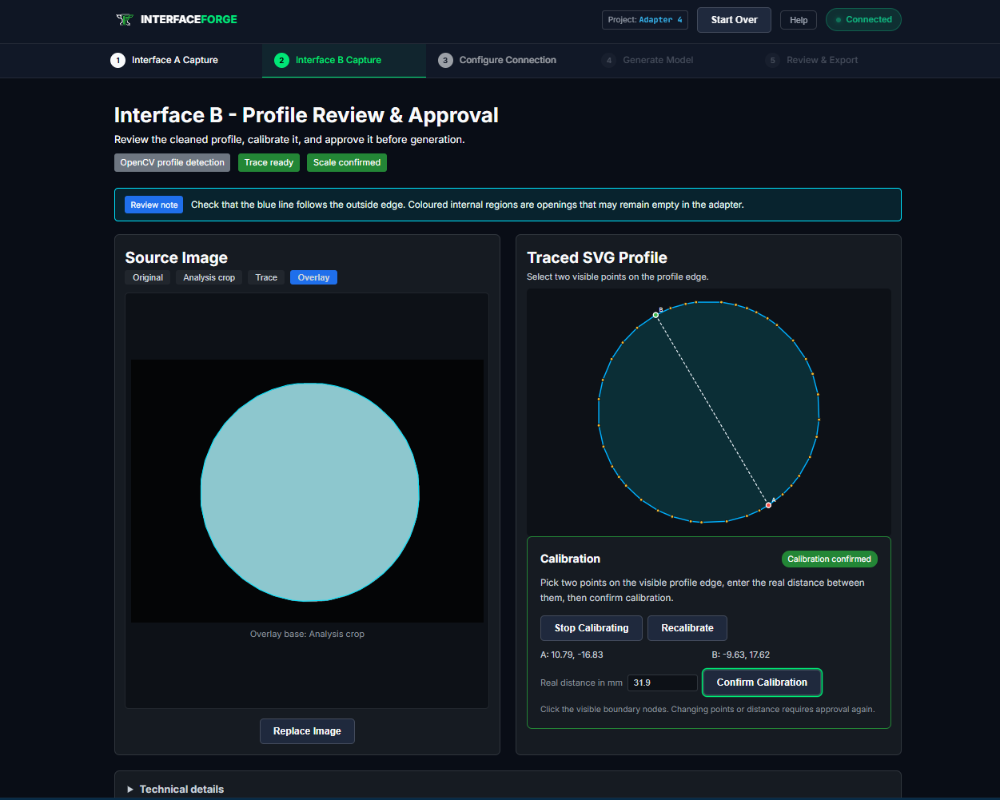
</p>

Both profiles must be reviewed and approved before model generation becomes available.

---

### Step 4 — Configure the adapter

Once both interfaces are approved, the user configures the connection.

<p align="center">
  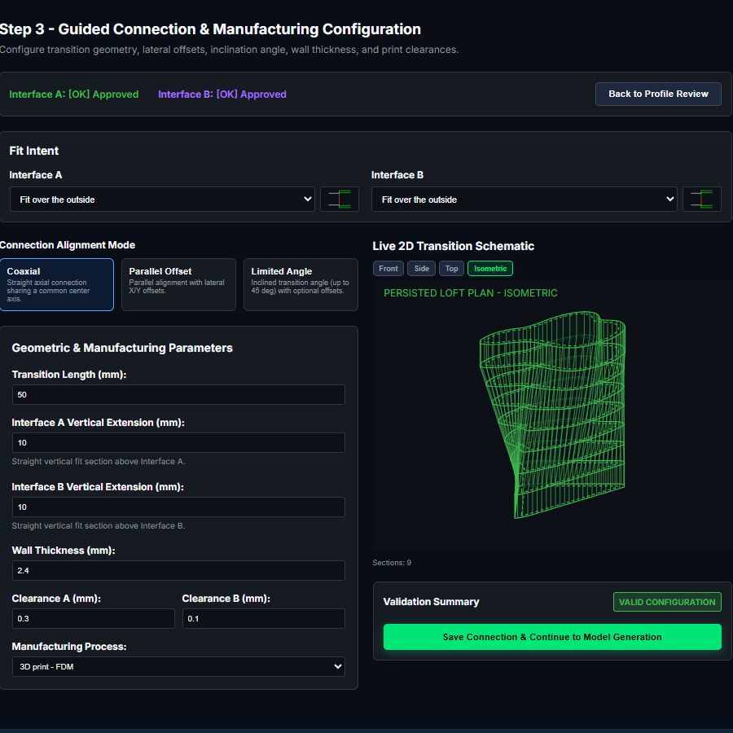
</p>

Available parameters include:

- fit-over or fit-inside intent for each interface;
- coaxial or parallel offset connection;
- transition length;
- X offset;
- Y offset;
- wall thickness;
- Interface A clearance;
- Interface B clearance;
- Interface A vertical extension;
- Interface B vertical extension.

<table>
  <tr>
    <th align="left">Connection mode</th>
    <th align="left">Behavior</th>
  </tr>
  <tr>
    <td><strong>Coaxial</strong></td>
    <td>Both interface profiles share the same central axis.</td>
  </tr>
  <tr>
    <td><strong>Offset</strong></td>
    <td>Interface B remains parallel but is displaced in X and/or Y.</td>
  </tr>
</table>

The vertical extensions add straight mating sections before and after the transition. A value of `0 mm` preserves a direct loft.

The same approved values drive:

- the canonical project schema;
- the persisted `LoftPlan`;
- the 3D preview;
- deterministic KCL;
- Zoo Engine generation;
- current STL and KCL exports.

---

### Step 5 — Generate, inspect, revise, and export

InterfaceForge:

1. validates the approved project;
2. builds the authoritative `LoftPlan`;
3. compiles deterministic KCL 2.0;
4. sends the KCL to Zoo Engine;
5. tracks the complete generation pipeline;
6. displays the resulting model;
7. prepares revision-current exports.

<p align="center">
  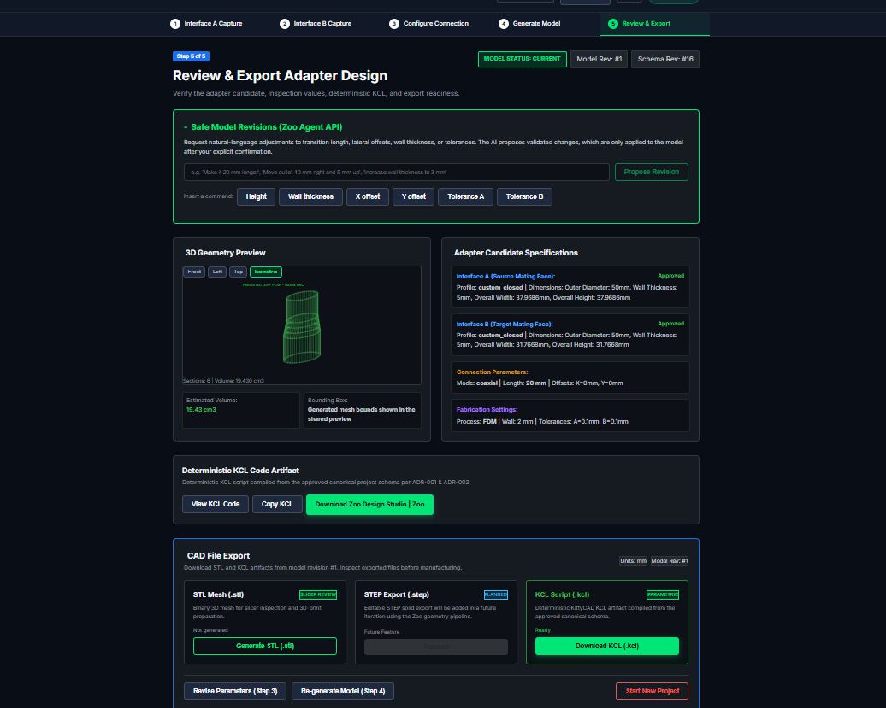
</p>

<table>
  <tr>
    <th align="left">Format</th>
    <th align="left">Purpose</th>
  </tr>
  <tr>
    <td><strong>KCL</strong></td>
    <td>Deterministic parametric source used to generate the adapter.</td>
  </tr>
  <tr>
    <td><strong>STL</strong></td>
    <td>Mesh output for inspection, slicing, and 3D printing.</td>
  </tr>
</table>

<p align="center">
  
  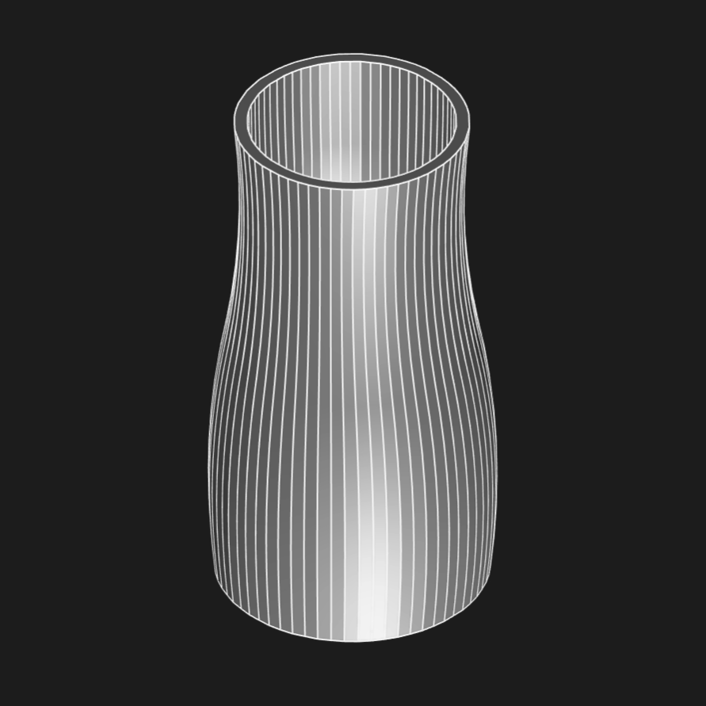
</p>

Exports remain tied to the current model revision. When an upstream parameter changes, existing exports become stale until regeneration finishes.

### Physical result

<p align="center">
  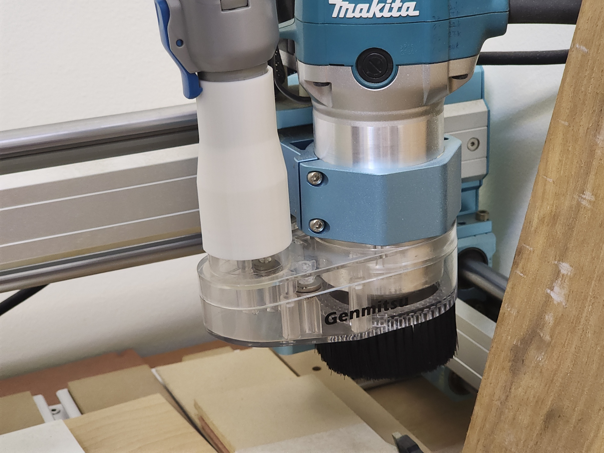
</p>

The physical print demonstrates the complete workflow from reviewed profiles to a printable adapter. It is demonstration evidence, not dimensional certification.

### Additional generated examples

<p align="center">
  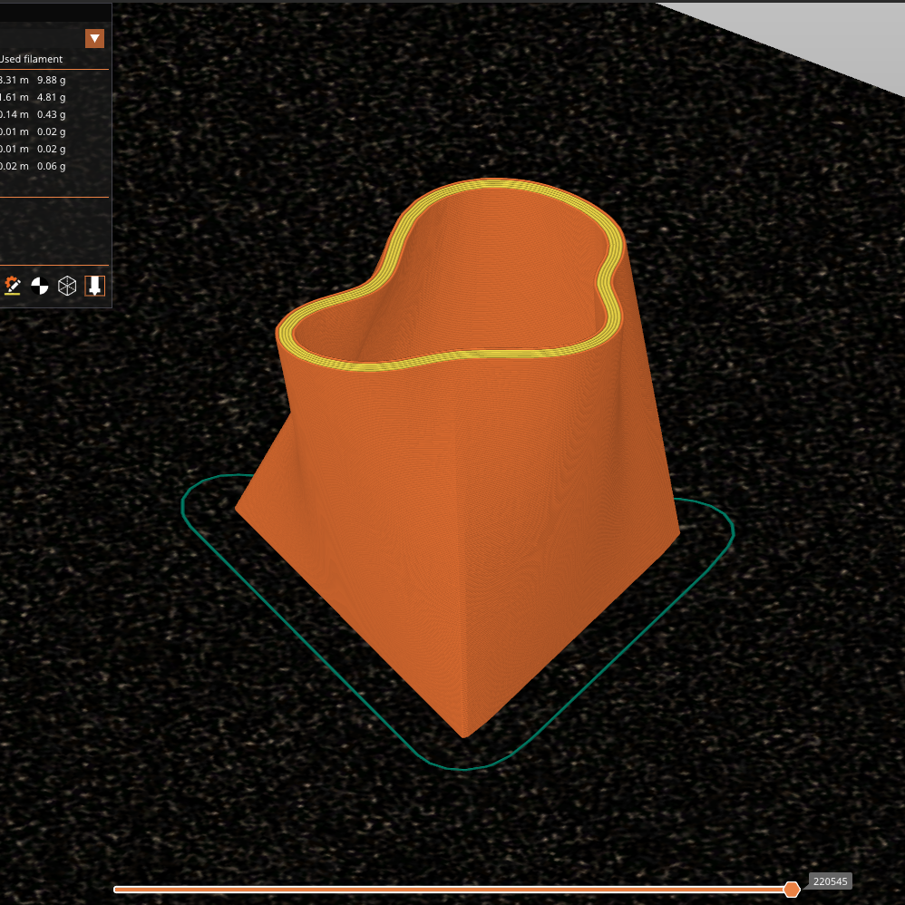
  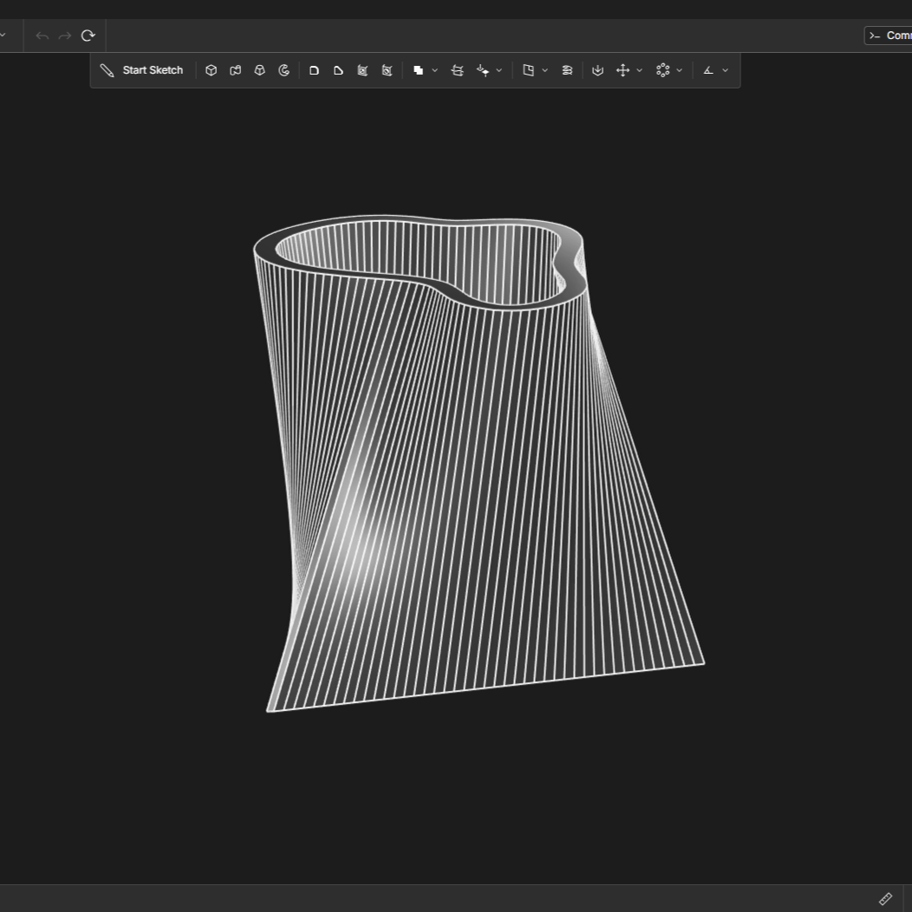
</p>

---

## Workflow 2 — Revise the adapter using Zoo Agent

After reaching Step 5, the user can request supported parameter changes in natural language.

Examples:

```text
Make the adapter 10 mm longer.
Increase the wall thickness to 3 mm.
Move the outlet 5 mm to the right.
Increase Interface A clearance by 0.2 mm.
Set the inlet extension to 15 mm.
Remove the outlet extension.
```

<p align="center">
  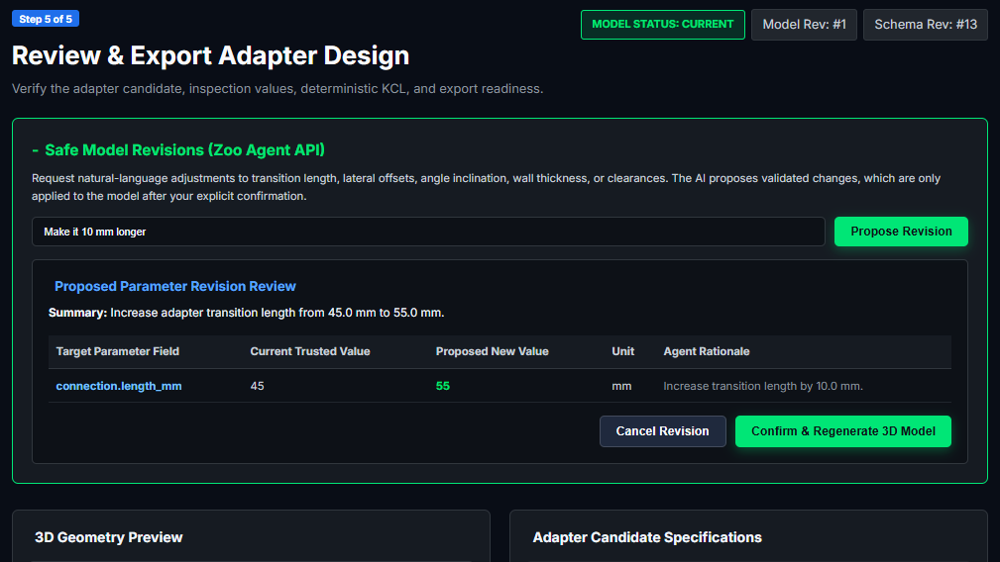
</p>

<p align="center">
  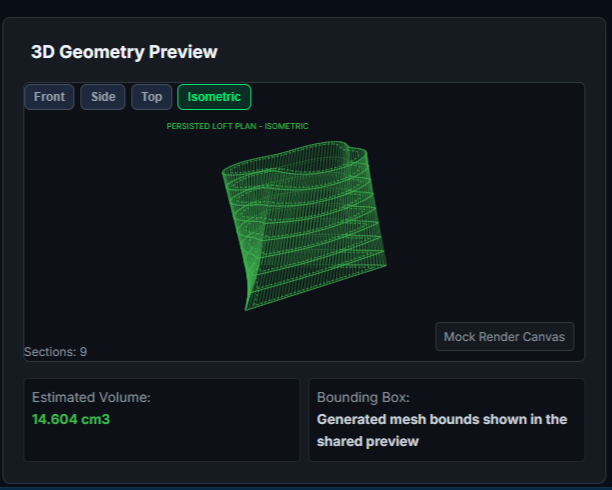
  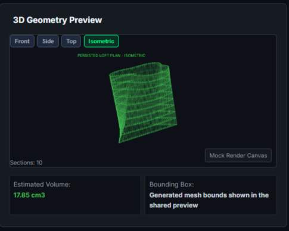
</p>

The revision flow is deliberately bounded:

1. Zoo Agent interprets the request.
2. InterfaceForge converts it into structured parameter changes.
3. The server validates the fields and recalculates arithmetic.
4. The user sees the before-and-after values.
5. Nothing changes until the proposal is explicitly confirmed.
6. The confirmed values update the canonical schema.
7. The adapter is regenerated through the Zoo Engine pipeline.
8. The preview and exports refresh only after the new model is current.

### Eight allowlisted revision fields

Zoo Agent may propose changes only to:

- transition length;
- Interface A extension;
- Interface B extension;
- X offset;
- Y offset;
- wall thickness;
- Interface A clearance;
- Interface B clearance.

It cannot directly alter:

- approved profile contours;
- uploaded source images;
- KCL source;
- provider settings;
- project authorization;
- export lineage;
- unsupported topology.

If regeneration fails, InterfaceForge preserves the previous successful model as the last-known-good revision.

---

# Supported scope

## Profiles

<table>
  <tr>
    <th align="left">Profile type</th>
    <th align="center">Review</th>
    <th align="center">Generation</th>
  </tr>
  <tr><td><strong>Circle</strong></td><td align="center">Supported</td><td align="center">Supported</td></tr>
  <tr><td><strong>Rectangle</strong></td><td align="center">Supported</td><td align="center">Supported</td></tr>
  <tr><td><strong>Rounded rectangle</strong></td><td align="center">Supported</td><td align="center">Supported</td></tr>
  <tr><td><strong>Approved traced closed profile</strong></td><td align="center">Supported</td><td align="center">Supported</td></tr>
</table>

## Connections and outputs

- Fit-over and fit-inside interfaces.
- Coaxial transitions.
- Parallel X/Y offset transitions.
- Straight interface extensions.
- Hollow solid-body KCL 2.0 geometry.
- STL and KCL exports.

## Outside the current submission

- Angle-based connections.
- Curved centreline transitions.
- Internal cavities in uploaded profiles.
- Multiple disconnected contours.
- Threads, mounting holes, countersinks, dovetails, and undercuts.
- Branches and assemblies.
- STEP export.
- Certified manufacturing output.

---

# Input requirements

The reliable workflow uses a **clean, dark, filled profile on a solid white background**.

<table>
  <tr><th align="left">Requirement</th><th align="left">Guidance</th></tr>
  <tr><td><strong>One profile</strong></td><td>Show a single complete planar opening.</td></tr>
  <tr><td><strong>Dark filled shape</strong></td><td>Use a solid silhouette rather than a thin outline.</td></tr>
  <tr><td><strong>Solid white background</strong></td><td>Black or transparent backgrounds may be interpreted as the full image rectangle.</td></tr>
  <tr><td><strong>No annotations</strong></td><td>Remove dimensions, arrows, text, leaders, and centre marks.</td></tr>
  <tr><td><strong>Complete boundary</strong></td><td>Keep the entire uncropped profile visible.</td></tr>
  <tr><td><strong>Preserved proportions</strong></td><td>Avoid angled photographs and perspective distortion.</td></tr>
  <tr><td><strong>Known distance</strong></td><td>Know the real distance between two selectable points.</td></tr>
</table>

<table>
  <tr>
    <td width="50%" align="center" valign="top">
      <strong>Recommended circular input</strong><br><br>
      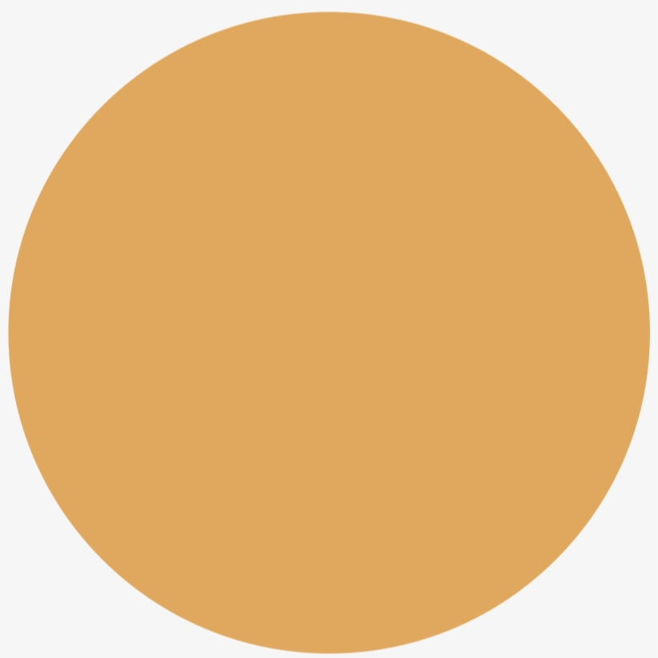
    </td>
    <td width="50%" align="center" valign="top">
      <strong>Recommended custom profile input</strong><br><br>
      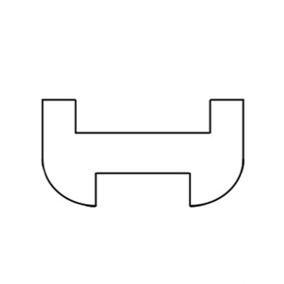
    </td>
  </tr>
</table>

### Why ordinary photographs are unreliable

Two-point calibration applies one uniform scale. It cannot repair:

- perspective distortion;
- camera tilt;
- lens distortion;
- hidden or obscured edges;
- an interface photographed at an angle;
- proportions already altered in the image.

Prepared silhouettes, scans, orthographic images, and clean planar profiles are therefore more reliable than unrestricted phone photographs.

<p align="center">
  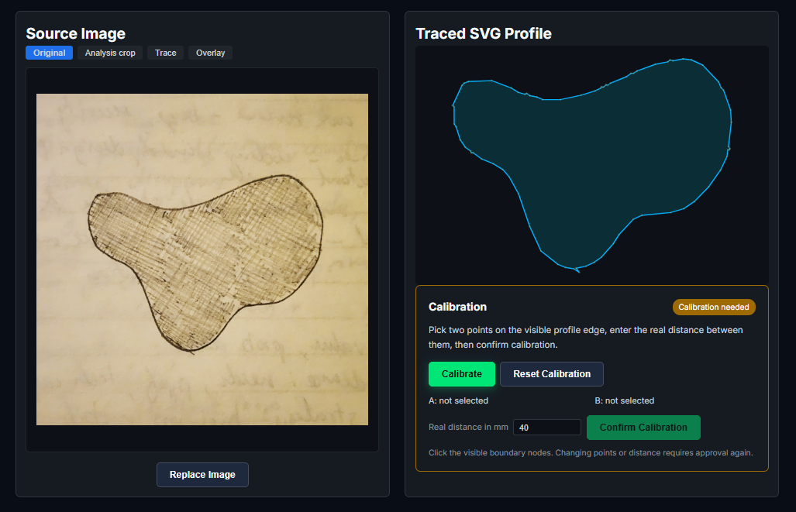
</p>

### Why dimensioned drawings are experimental

Classical image processing may interpret dimensions, arrows, leaders, text, centre marks, and extension lines as geometry. These can introduce false contours or cause the wrong boundary to be selected.

<p align="center">
  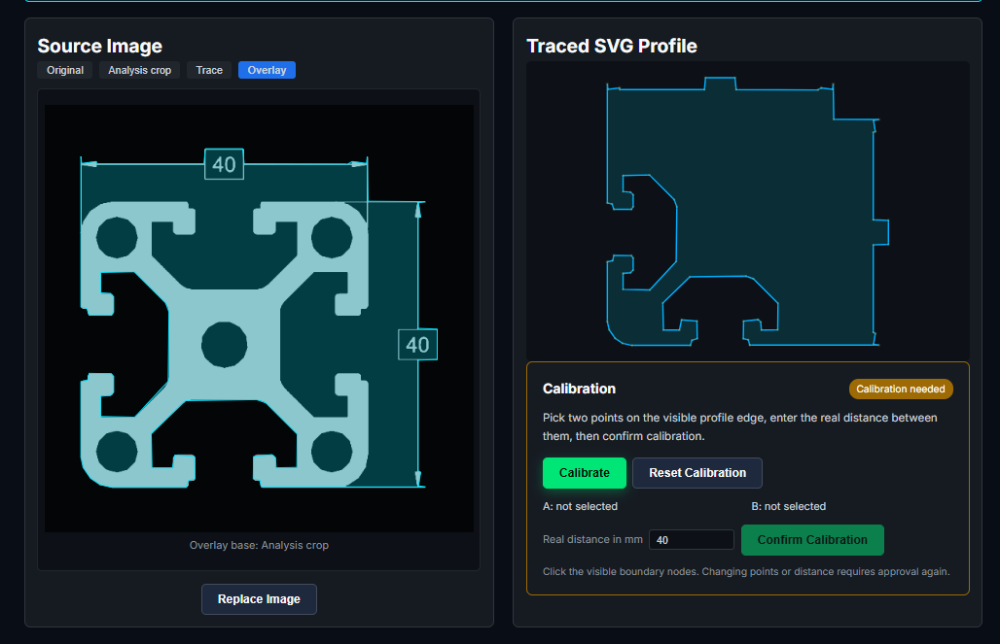
</p>

Dimensioned drawings therefore require especially careful review.

---

# Why InterfaceForge exists beside Zoo Design Studio

InterfaceForge does not attempt to replace Zoo Design Studio. It provides a constrained, adapter-specific workflow around Zoo’s programmable CAD infrastructure.

<table>
  <tr><th align="left">InterfaceForge</th><th align="left">Zoo</th></tr>
  <tr><td>Guides the two-interface workflow</td><td>Executes authoritative CAD geometry</td></tr>
  <tr><td>Captures and calibrates profiles</td><td>Provides KCL and modelling infrastructure</td></tr>
  <tr><td>Requires explicit geometry approval</td><td>Runs deterministic KCL through Zoo Engine</td></tr>
  <tr><td>Applies adapter-specific validation</td><td>Produces the generated model and STL result</td></tr>
  <tr><td>Constrains and validates revisions</td><td>Interprets revision intent through Zoo Agent</td></tr>
  <tr><td>Tracks schema, models, and stale exports</td><td>Provides programmable CAD infrastructure</td></tr>
</table>

---

# Zoo integration

InterfaceForge was built for the **Zoo API Makeathon 2026**.

<div align="center">
  <a href="https://zoo.dev/">
    
  </a>
</div>

<table>
  <tr>
    <td width="50%" valign="top">
      <h3>Zoo Engine API</h3>
      <ul>
        <li>Executes deterministic KCL generated from the approved project.</li>
        <li>Produces the authoritative CAD model.</li>
        <li>Supports current STL generation and KCL lineage.</li>
      </ul>
    </td>
    <td width="50%" valign="top">
      <h3>Zoo Agent API</h3>
      <ul>
        <li>Interprets natural-language revision requests.</li>
        <li>Operates behind an eight-field server-side allowlist.</li>
        <li>Returns proposals that require explicit confirmation.</li>
      </ul>
    </td>
  </tr>
</table>

Zoo Agent never writes KCL or edits approved contours directly. Final geometry remains deterministic and controlled by InterfaceForge’s canonical schema and persisted `LoftPlan`.

Learn more at [zoo.dev](https://zoo.dev/) and in the [API usage guide](docs/API_USAGE.md).

---

# Technical architecture

```text
React + TypeScript frontend
          │
          ▼
FastAPI application and workflow services
          │
          ├── OpenCV profile analysis
          ├── Canonical project schema
          ├── Validation and approval gates
          ├── Persisted LoftPlan
          ├── Deterministic KCL compiler
          ├── Zoo Agent bounded revisions
          └── Zoo Engine model generation
                         │
                         ▼
             Revision-current STL + KCL
```

<table>
  <tr><th align="left">Layer</th><th align="left">Technology</th><th align="left">Responsibility</th></tr>
  <tr><td><strong>Frontend</strong></td><td>React 18, TypeScript 5, Vite</td><td>Guided workflow, calibration, approval, generation progress, revisions, and exports.</td></tr>
  <tr><td><strong>Backend</strong></td><td>Python 3.14, FastAPI, Pydantic</td><td>Workflow invariants, validation, persistence, KCL compilation, providers, and exports.</td></tr>
  <tr><td><strong>Persistence</strong></td><td>SQLite</td><td>Canonical state, schema revisions, model revisions, and last-known-good recovery.</td></tr>
  <tr><td><strong>Profile analysis</strong></td><td>OpenCV, NumPy, Pillow</td><td>Image validation, contour extraction, primitive recognition, and trace preparation.</td></tr>
  <tr><td><strong>CAD</strong></td><td>KCL 2.0, Zoo Engine, Zoo Agent</td><td>Deterministic geometry execution and bounded natural-language revisions.</td></tr>
</table>

### Deployment

- **Frontend:** Cloudflare Pages
- **Backend:** FastAPI on Render
- **Persistence:** SQLite through `DB_PATH`
- **Frontend API configuration:** `VITE_BACKEND_URL`
- **Credentials:** backend environment only
- **Runtime artifacts:** ignored upload, trace, KCL, preview, and export storage

Render filesystem durability is deployment-dependent and is not presented as permanent production storage.

---

# Judge quick start

> Live demo note: The deployed app runs on free-tier hosting, so the backend may take up to a minute to wake after inactivity.

> Live 3D generation can also take around 1–2 minutes depending on hosting and Zoo API response times.

1. Open the [live application](https://interfaceforge.pages.dev/).
2. Upload any image from `samples/manual_qa/` as Interface A.
3. Upload any image from `samples/manual_qa/` as Interface B.
4. For each profile, select two points representing a known `40 mm` distance.
5. Confirm calibration, inspect the detected profile, and approve it.
6. Configure fit-over for both interfaces, coaxial mode, `40 mm` length, `2.4 mm` wall thickness, `0.1 mm` Interface A clearance, and `0.1 mm` Interface B clearance.
7. Generate and inspect the model.
8. Enter `Make the adapter 10 mm longer.`
9. Review the proposed values and confirm the revision.
10. Wait for regeneration to finish, then inspect the updated model and exports.

Expected result:

- two approved profiles;
- a persisted authoritative `LoftPlan`;
- deterministic KCL 2.0;
- a Zoo-generated adapter when the live provider is available;
- current STL and KCL exports;
- bounded, user-confirmed Agent revisions.

For deterministic local testing, configure the backend providers as described in [backend/README.md](backend/README.md).

---

# Local setup

## Prerequisites

- Python 3.14
- Node.js 18 or newer
- npm 9 or newer
- Zoo API credentials for live Engine and Agent execution

## Install

```powershell
py -3.14 -m venv venv314
.\venv314\Scripts\python.exe -m pip install --upgrade pip
.\venv314\Scripts\python.exe -m pip install -e backend[dev]

cd frontend
npm install
cd ..
```

Create the backend environment file from the included example and add the required provider credentials.

## Run frontend and backend together

```powershell
python scripts/start_local.py
```

Open:

- Frontend: `http://localhost:5173`
- Backend: `http://localhost:8000`
- FastAPI documentation: `http://localhost:8000/docs`

## Run services separately

```powershell
python scripts/run_backend.py
python scripts/run_frontend.py
```

---

# Testing

Run the complete project verification script:

```powershell
python scripts/run_all_checks.py
```

Run suites separately:

```powershell
# Backend
.\venv314\Scripts\python.exe -m pytest backend\tests

# Frontend
cd frontend
npm test
npm run build
cd ..
```

Live Zoo verification requires valid credentials and is recorded separately from deterministic offline tests.

See:

- [Test plan](docs/TEST_PLAN.md)
- [Test results](docs/TEST_RESULTS.md)
- [Live integration checklist](docs/ZOO_LIVE_INTEGRATION_CHECKLIST.md)

---

# Verification and evidence boundaries

The repository distinguishes offline validation from live Zoo evidence.

- Focused backend, API, frontend, compiler, and revision tests are recorded in the maintained test documentation.
- A prior credentialed Zoo Agent integration completed successfully.
- During the focused 2026-08-04 audit, 17 of 18 Agent attempts timed out or closed at the WebSocket transport layer.
- Prior project evidence verified STL export.
- The latest direct live Engine audit timed out before a fresh STL conversion completed.
- Transport failures are not presented as confirmed Zoo bugs without reliable attribution.
- Offline mock tests are not presented as proof of live-provider reliability.

See [Bugs and limitations](docs/BUGS_AND_LIMITATIONS.md) and [Zoo API notes](docs/ZOO_API_NOTES.md) for the full evidence record.

---

# Documentation map

<table>
  <tr><th align="left">Document</th><th align="left">Purpose</th></tr>
  <tr><td><a href="InterfaceForge_PRD_v0.1.md">Implemented product record</a></td><td>Current scope, requirements, success criteria, and exclusions.</td></tr>
  <tr><td><a href="user_flow.md">User flow</a></td><td>Workflow gates, recovery paths, and state transitions.</td></tr>
  <tr><td><a href="technical_design.md">Technical design</a></td><td>Detailed components, state, security, providers, and data flow.</td></tr>
  <tr><td><a href="docs/ARCHITECTURE.md">Architecture</a></td><td>Deployment topology and system boundaries.</td></tr>
  <tr><td><a href="docs/API_USAGE.md">API usage</a></td><td>Active routes, payload contracts, and Zoo integration.</td></tr>
  <tr><td><a href="docs/DESIGN_SCHEMA.md">Design schema</a></td><td>Canonical project data and revision fields.</td></tr>
  <tr><td><a href="docs/GEOMETRY_RULES.md">Geometry rules</a></td><td>Calibration, profile preparation, fit, and validation rules.</td></tr>
  <tr><td><a href="docs/DESIGN_DECISIONS.md">Design decisions</a></td><td>Architecture decisions and explicitly superseded behavior.</td></tr>
  <tr><td><a href="docs/BUGS_AND_LIMITATIONS.md">Bugs and limitations</a></td><td>Known product limitations and classified audit observations.</td></tr>
  <tr><td><a href="docs/ZOO_API_NOTES.md">Zoo API notes</a></td><td>Live-provider findings and evidence boundaries.</td></tr>
  <tr><td><a href="docs/TEST_RESULTS.md">Test results</a></td><td>Recorded verification outcomes and remaining blockers.</td></tr>
  <tr><td><a href="docs/DEMO_SCRIPT.md">Demo script</a></td><td>Final video sequence and talking points.</td></tr>
  <tr><td><a href="docs/SUBMISSION_CHECKLIST.md">Submission checklist</a></td><td>Competition deliverables and external verification.</td></tr>
</table>

Recommended technical audit path:

```text
README
  → technical_design.md
  → docs/API_USAGE.md
  → docs/BUGS_AND_LIMITATIONS.md
  → docs/TEST_RESULTS.md
```

`production_docs/` and `ascii_wireframes.md` preserve historical implementation stages. They may contain superseded architecture, fields, or scope and do not define current submission behavior.

---

# Current limitations

- The reliable input is a clean, dark, filled profile on a solid white background.
- Black or transparent backgrounds may cause the full image rectangle to be detected.
- Source images must already preserve their proportions.
- Calibration establishes scale but does not correct perspective.
- Dimensioned and annotation-heavy drawings are experimental.
- Only one closed outer profile is extracted from each input.
- Internal cavities are not supported.
- Angle-based and curved connections are not supported.
- STEP export is not implemented.
- Threads, mounting features, undercuts, branches, and assemblies are outside the current scope.
- Provider availability and transport reliability can affect live generation.
- Outputs require user inspection before printing or manufacturing.

---

# Credits and licence

InterfaceForge is available under the [MIT License](LICENSE).

It is an independent Zoo API Makeathon project and is not an official Zoo product.

<div align="center">

  <h3>Powered by</h3>

  <a href="https://zoo.dev/">
    
  </a>

  <p>
    Zoo Engine, KCL, programmable CAD execution, STL generation, and bounded natural-language revisions.
  </p>

  <br>

  <h3>Built by</h3>

  <a href="https://joravarsinghing.github.io/portfolio/">
    
  </a>

  <p>
    <strong><a href="https://joravarsinghing.github.io/portfolio/">Joravar Singh</a></strong><br>
    Product concept, engineering direction, implementation coordination, testing, and submission development.
  </p>

  <br>

  

  <p><sub>Reviewed geometry. Deterministic CAD. Bounded AI revisions.</sub></p>

</div>
