# InterfaceForge — Implementation-Ready User Flows

**Document status:** Draft v0.1  
**Source of truth:** `InterfaceForge_PRD_v0.1.md`  
**Audience:** Product owner, UX/UI designers, Codex, Antigravity/Gemini, Claude, QA agents, and implementation agents  
**Scope:** Zoo API Makeathon MVP

---

## 1. Document Purpose

This document translates the InterfaceForge PRD into implementation-ready user flows.

It covers the primary unauthenticated maker/workshop user. The PRD explicitly excludes user accounts from the MVP, so no separate authenticated customer, administrator, or billing role is defined.

### Cross-flow rules

- The user must approve both interface profiles before 3D generation.
- User-entered, image-extracted, system-inferred, and unresolved dimensions must remain visibly distinct.
- The system must not silently generate geometry from unresolved critical values.
- Errors must include a plain-language explanation, corrective action, and internal error ID.
- Raw KCL is an export artifact, not the primary editing experience.
- Natural-language revisions may only produce validated parameter changes.
- No critical information may be available only through color or the 3D viewport.

### PRD conflict / ambiguity flags

1. **Authentication states:** The requested flow template requires unauthorized states, but the PRD excludes user accounts. In this document, “unauthorized” refers only to unavailable or rejected server-side Zoo/AI credentials. The user is not asked to sign in.
2. **Session persistence:** Local project persistence is optional in the PRD. Unless implemented, leaving or refreshing the page may discard progress. This is marked `TBD` where relevant.
3. **Profile extraction:** The PRD requires image/sketch upload and editable SVG extraction but does not define whether users can manually draw a profile from scratch. Manual drawing is therefore not assumed.
4. **3D viewer:** The PRD requires a final 3D preview but does not specify whether it is interactive geometry, streamed rendering, snapshots, or GLB. User-facing flow language remains viewer-neutral.
5. **Export source:** The workflow exports supported STL and KCL artifacts. STEP is planned but not implemented for this submission.

---

# Primary User Flows

## UF-001: Start a New Adapter Project

* **Actor:** Hobbyist, maker, workshop user, technician, or 3D-printing service operator
* **Goal:** Begin a new adapter project and understand the workflow before uploading anything.
* **Preconditions:**
  - InterfaceForge is reachable in a supported desktop browser.
  - No authentication is required.
  - The user has two physical interfaces to connect.
* **Trigger / entry point:**
  - User opens the InterfaceForge landing page.
  - User selects **Create an Adapter**.
* **Happy path:**
  1. The system displays a concise product explanation: “Two interfaces in. One parametric adapter out.”
  2. The system shows the workflow stages:
     1. Capture Interface A
     2. Capture Interface B
     3. Choose connection
     4. Generate
     5. Review and export
  3. The user selects **Start Project**.
  4. The system creates a temporary project session.
  5. The system navigates to **Interface A — Upload**.
  6. A step indicator shows the user is at Step 1.
* **Alternative paths:**
  - User selects a sample project:
    - Vacuum hose to dust port.
    - Simple camera plate adapter.
  - System loads sample inputs and navigates to the relevant review or configuration stage.
  - `Assumption:` Sample projects are allowed for onboarding but do not replace the live competition flow.
* **Validation errors:**
  - None at project start.
* **Permission/auth errors:**
  - No user authentication exists.
  - If required backend credentials are unavailable, show a non-blocking service status notice before the user invests time:
    - “Model generation is temporarily unavailable. You may explore the workflow, but final generation cannot complete.”
* **System failures and recovery:**
  - Session creation fails:
    1. Show **Project could not start**.
    2. Preserve the landing page.
    3. Offer **Try Again**.
    4. Log an internal error ID.
* **Cancellation / exit behavior:**
  - User can leave without confirmation because no project data exists yet.
  - `TBD:` Whether an empty local session is retained.
* **Postconditions:**
  - A temporary project session exists.
  - User is on the Interface A upload screen.
* **Required UI states:**
  - **Default:** Landing page with product explanation and CTA.
  - **Loading:** Starting project/session.
  - **Empty:** New project with no interfaces.
  - **Success:** Redirect to Interface A upload.
  - **Error:** Session creation failed.
  - **Unauthorized:** Backend credentials unavailable; no user sign-in prompt.
* **Accessibility notes:**
  - Workflow stages must be readable as text, not only icons.
  - Main CTA must have a descriptive accessible name.
  - Step indicator must expose current step to screen readers.
  - Avoid auto-playing instructional media.
* **Assumptions / open questions:**
  - `TBD:` Supported browsers.
  - `TBD:` Whether a sample project is in the MVP.
  - `TBD:` Whether local session persistence is implemented.

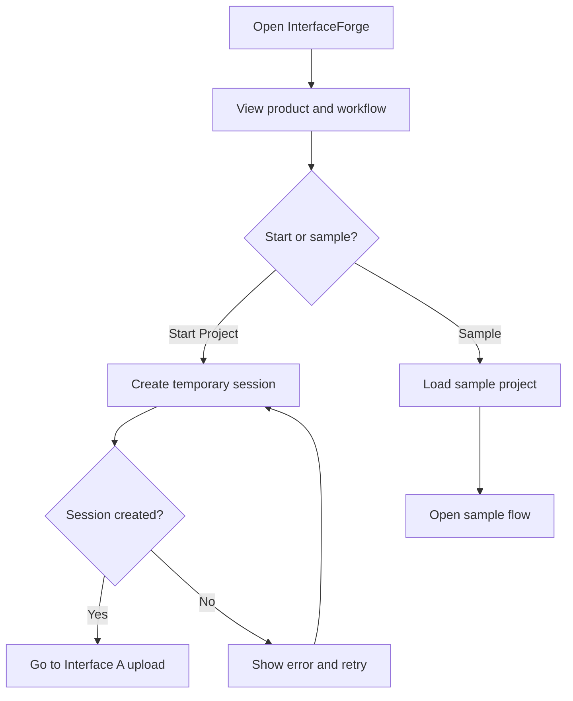

---

## UF-002: Upload and Validate an Interface Image or Sketch

* **Actor:** Primary user
* **Goal:** Provide a usable image or sketch for one physical interface.
* **Preconditions:**
  - A project session exists.
  - User is on Interface A or Interface B upload.
  - The relevant interface is not yet approved.
* **Trigger / entry point:**
  - User reaches an interface upload step.
  - User selects **Upload Image or Sketch**.
* **Happy path:**
  1. The system displays visual capture guidance before file selection:
     - photograph directly facing the interface;
     - avoid perspective tilt;
     - use strong contrast;
     - include visible dimensions or be ready to enter them;
     - avoid cropping edges;
     - avoid reflections and shadows.
  2. The user reviews examples of acceptable and unacceptable images.
  3. The user chooses an image file.
  4. The system validates file type and size.
  5. The system displays an image preview.
  6. The user confirms **Use This Image**.
  7. The system uploads and begins profile interpretation.
  8. The system navigates to the processing state.
* **Alternative paths:**
  - User replaces the selected image before upload.
  - User cancels file selection and remains on the upload screen.
  - User uploads a digitally drawn sketch rather than a photograph.
  - `TBD:` Direct camera capture from browser.
* **Validation errors:**
  - Unsupported file type.
  - File exceeds size limit.
  - Image dimensions are too small.
  - Image is corrupt.
  - Multiple disconnected profiles are detected where one outer profile is expected.
  - The interface is cropped or not visible enough.
  - For each error:
    1. Explain the problem.
    2. Show how to correct it.
    3. Keep the upload screen available.
* **Permission/auth errors:**
  - Browser denies camera permission if direct camera capture is implemented:
    - explain how to re-enable permission;
    - preserve file upload as fallback.
  - No account authentication is required.
* **System failures and recovery:**
  - Upload fails due to network:
    - preserve selected preview where possible;
    - show **Retry Upload**;
    - allow **Choose Another Image**.
  - Interpretation service unavailable:
    - keep the uploaded image in the current session if privacy policy permits;
    - offer **Retry Analysis**;
    - explain that final generation cannot continue yet.
* **Cancellation / exit behavior:**
  - User can return to the previous stage.
  - If an upload is in progress, ask whether to cancel it.
  - Leaving after successful upload but before approval:
    - `TBD:` save locally or warn that work may be lost.
* **Postconditions:**
  - A valid source image is associated with Interface A or B.
  - Profile interpretation has started or is ready to start.
* **Required UI states:**
  - **Default:** Guidance and upload control.
  - **Loading:** File upload and image interpretation.
  - **Empty:** No file selected.
  - **Success:** Preview accepted and processing started.
  - **Error:** Invalid file, bad image, upload failure, analysis failure.
  - **Unauthorized:** Camera permission denied or backend credential problem.
* **Accessibility notes:**
  - Good/bad examples require text descriptions.
  - Upload control must be keyboard accessible.
  - Selected filename and upload progress must be announced.
  - Drag-and-drop cannot be the only upload method.
  - Error messages must be linked to the upload field.
* **Assumptions / open questions:**
  - `TBD:` File formats and maximum size.
  - `TBD:` Whether direct camera capture is included.
  - `Assumption:` One source image per interface in the MVP.
  - `Assumption:` The user may upload a hand sketch or photograph.

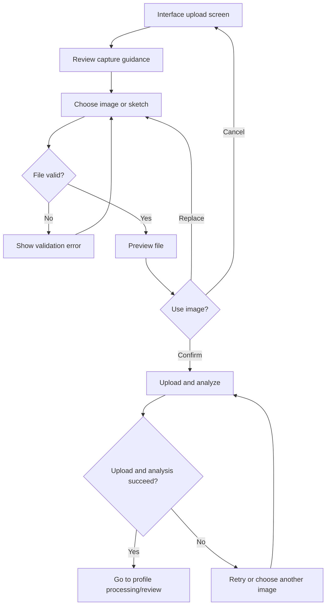

---

## UF-003: Review, Correct, and Approve an Interface Profile

* **Actor:** Primary user
* **Goal:** Verify that InterfaceForge correctly understood one interface before 3D generation.
* **Preconditions:**
  - A source image has been successfully uploaded.
  - Profile extraction has returned a supported profile or a recoverable result.
* **Trigger / entry point:**
  - Image interpretation completes.
  - User is redirected to **Review Interface A/B**.
* **Happy path:**
  1. The system displays:
     - source image;
     - cleaned SVG profile;
     - centerline or reference origin where applicable;
     - dimension annotations;
     - confidence/provenance labels.
  2. The system identifies the likely profile type:
     - circle;
     - rectangle;
     - rounded rectangle;
     - traced closed profile.
  3. The system lists all dimensions and labels each as:
     - user-entered;
     - image-extracted;
     - system-inferred;
     - unresolved.
  4. The user enters at least two known dimensions.
  5. The system recalculates scale and updates the SVG.
  6. The user edits any incorrect dimension values.
  7. The system validates the updated profile.
  8. The user reviews warnings and inferred dimensions.
  9. The user selects **Approve Interface**.
  10. The system marks the interface approved and prevents silent changes.
  11. Navigation:
      - After Interface A approval, go to Interface B upload.
      - After Interface B approval, go to connection selection.
* **Alternative paths:**
  - User changes the detected profile type.
  - User selects **Upload a Better Image**.
  - User edits a supported dimension and selects **Update Profile**.
  - `Optional/P2:` User drags major control points.
  - User approves despite non-critical inferred values after acknowledging them.
* **Validation errors:**
  - Fewer than two known dimensions.
  - Contradictory dimensions.
  - Invalid negative or zero dimension.
  - Open contour.
  - Self-intersecting contour.
  - Excessive point count/noise.
  - Unsupported internal openings.
  - Scale cannot be determined.
  - Critical dimension remains unresolved.
  - Error behavior:
    1. Highlight affected dimension/profile area.
    2. Explain why approval is blocked.
    3. Offer a correction or re-upload action.
* **Permission/auth errors:**
  - No user authentication.
  - If vision or validation services reject credentials, show service failure and preserve entered values locally in the current session.
* **System failures and recovery:**
  - SVG regeneration fails:
    - retain last valid SVG;
    - mark new values unsaved;
    - offer retry.
  - Validation service fails:
    - do not approve;
    - retain all user changes;
    - show retry and internal error ID.
  - Session expires:
    - `TBD:` recover from local state or explain that the project must restart.
* **Cancellation / exit behavior:**
  - User may return to upload.
  - If dimensions were edited, ask whether to discard changes before re-uploading.
  - User may exit to landing page:
    - `TBD:` save locally or show loss warning.
* **Postconditions:**
  - Interface is approved and stored in the canonical project schema.
  - Approved dimensions and provenance are locked until the user explicitly reopens the interface.
* **Required UI states:**
  - **Default:** Source + SVG + editable dimensions.
  - **Loading:** Recalculating profile or validating.
  - **Empty:** No dimensions entered yet.
  - **Success:** Interface approved.
  - **Error:** Invalid profile or conflicting dimensions.
  - **Unauthorized:** Backend credentials unavailable; current edits preserved.
* **Accessibility notes:**
  - Dimension provenance must use text/icon labels in addition to color.
  - Every SVG annotation must have an equivalent editable form field.
  - User must be able to complete the flow without dragging.
  - Changes in profile validation status should be announced.
  - Source image and SVG should support zoom controls operable by keyboard.
* **Assumptions / open questions:**
  - `TBD:` Whether users can add/remove traced-profile points.
  - `TBD:` Whether approval with low-confidence inferred values is allowed.
  - `Assumption:` Critical unresolved dimensions block approval.
  - `Assumption:` Approved profiles can later be reopened, which invalidates the generated model until reapproved.

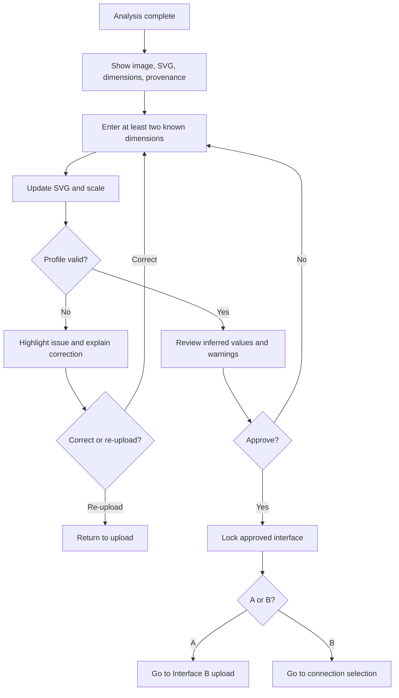

---

## UF-004: Reopen and Modify an Approved Interface

* **Actor:** Primary user
* **Goal:** Correct an already approved interface after noticing an error.
* **Preconditions:**
  - At least one interface has been approved.
  - The project has not been permanently submitted; no such submission concept exists in MVP.
* **Trigger / entry point:**
  - User selects **Edit Interface A** or **Edit Interface B** from connection, result, or revision screen.
* **Happy path:**
  1. The system warns:
     - editing an approved interface may invalidate connection settings and generated geometry.
  2. The user selects **Continue Editing**.
  3. The system returns to the relevant profile review screen.
  4. Existing image, SVG, dimensions, and provenance are restored.
  5. The user changes values.
  6. The system revalidates the profile.
  7. The user reapproves it.
  8. The system marks downstream generated artifacts stale.
  9. The system navigates to connection configuration for reconfirmation.
* **Alternative paths:**
  - User selects **Cancel** and returns without changes.
  - User reuploads the interface image.
* **Validation errors:**
  - Same profile and dimension validation as UF-003.
* **Permission/auth errors:**
  - No user authentication.
  - Backend service credential failure must not erase approved data.
* **System failures and recovery:**
  - Restore fails:
    - offer retry;
    - do not overwrite existing approved interface.
  - Revalidation fails:
    - retain last approved version separately;
    - allow reverting to it.
  - `Assumption:` Version rollback is limited to the immediately previous approved profile.
* **Cancellation / exit behavior:**
  - Before reapproval, user may choose **Discard Changes** and restore the last approved version.
  - Leaving the app follows session persistence behavior (`TBD`).
* **Postconditions:**
  - Updated interface is approved.
  - Existing 3D result and exports are marked stale and cannot be presented as current.
  - Connection configuration must be reconfirmed.
* **Required UI states:**
  - **Default:** Edit warning and restored profile.
  - **Loading:** Restoring or validating.
  - **Empty:** Not applicable unless source data is missing.
  - **Success:** Reapproved; downstream state invalidated.
  - **Error:** Restore or validation failure.
  - **Unauthorized:** Service credentials unavailable.
* **Accessibility notes:**
  - Warning must clearly state consequences.
  - **Continue Editing** and **Cancel** labels must be explicit.
  - Stale-state notification must be exposed to assistive technology.
* **Assumptions / open questions:**
  - `Assumption:` Reopening an interface invalidates generated geometry.
  - `TBD:` Whether previous approved versions beyond one rollback are stored.
  - `TBD:` Whether connection settings are retained as suggested values or reset.

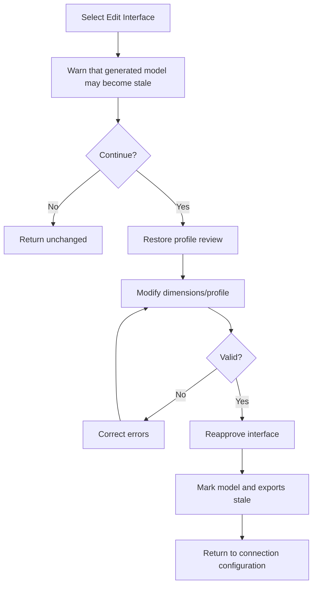

---

## UF-005: Select and Configure the Connection

* **Actor:** Primary user
* **Goal:** Define how the two approved interfaces should connect in 3D space.
* **Preconditions:**
  - Interface A is approved.
  - Interface B is approved.
  - Both profiles remain valid.
* **Trigger / entry point:**
  - Interface B approval completes.
  - User returns from editing a profile.
* **Happy path:**
  1. The system displays both approved interface summaries.
  2. The system offers three connection modes with visual explanations:
     - **Coaxial:** profiles share a center axis.
     - **Offset:** profiles remain parallel but centers differ.
     - **Angled:** profiles connect at a limited relative angle.
  3. The user selects one mode.
  4. The system displays only parameters valid for that mode.
  5. The user sets:
     - transition length;
     - X/Y offset where applicable;
     - angle where applicable;
     - wall thickness;
     - fit/clearance for each end.
  6. A live visual guide updates as values change.
  7. The system validates geometric and manufacturability limits.
  8. The system displays warnings and recommended values.
  9. The user confirms **Generate Adapter**.
  10. The system saves connection parameters into the canonical schema.
  11. The system navigates to generation.
* **Alternative paths:**
  - User selects a different connection mode; incompatible values reset or are explicitly remapped.
  - User applies recommended defaults.
  - User returns to edit either interface.
  - `Optional:` User selects fit presets such as loose, slip, snug, or custom.
* **Validation errors:**
  - Transition length below minimum.
  - Offset too large for length.
  - Angle exceeds supported limit.
  - Wall thickness below minimum.
  - Clearance outside supported range.
  - Resulting path is likely to self-intersect.
  - Unsupported profile combination.
  - Behavior:
    - block generation for critical errors;
    - show warning-only status for non-critical concerns;
    - identify which field must change.
* **Permission/auth errors:**
  - No user authentication.
  - Backend availability may be checked before final submission; if unavailable, allow configuration but disable generation with explanation.
* **System failures and recovery:**
  - Live preview calculation fails:
    - retain parameter values;
    - show last valid preview;
    - mark preview stale;
    - offer retry.
  - Project schema save fails:
    - remain on page;
    - do not start generation;
    - retry without losing values.
* **Cancellation / exit behavior:**
  - User may return to profile review.
  - If the user changes mode after entering values, confirm before discarding incompatible settings.
  - Leaving app follows session persistence behavior (`TBD`).
* **Postconditions:**
  - A valid connection configuration exists in the canonical design schema.
  - Project is ready for KCL generation.
* **Required UI states:**
  - **Default:** Mode cards and default parameters.
  - **Loading:** Updating visual guide or validating.
  - **Empty:** No connection mode selected.
  - **Success:** Configuration valid; generation enabled.
  - **Error:** Invalid combination or preview failure.
  - **Unauthorized:** Remote generation unavailable due to service credentials.
* **Accessibility notes:**
  - Each mode must have text explanation and diagram alt text.
  - Parameter changes must not rely solely on animated graphics.
  - Sliders, if used, must have numeric inputs.
  - Validation summary should link to affected fields.
  - Live updates should not announce excessively; announce only meaningful validation changes.
* **Assumptions / open questions:**
  - `TBD:` Exact angle, offset, and length limits.
  - `TBD:` Default wall thickness and clearance presets.
  - `Assumption:` Angled means a straight loft between rotated profile planes, not a curved duct path.
  - `Assumption:` No unrestricted 3D transform gizmo exists in MVP.

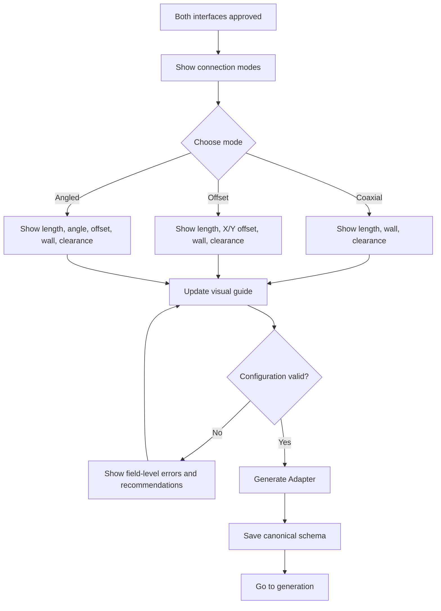

---

## UF-006: Generate and Review the Parametric Adapter

* **Actor:** Primary user
* **Goal:** Generate the 3D adapter and verify the result before revision or export.
* **Preconditions:**
  - Both profiles are approved.
  - Connection configuration is valid.
  - Required Zoo services are available.
* **Trigger / entry point:**
  - User selects **Generate Adapter**.
* **Happy path:**
  1. The system validates the complete canonical schema.
  2. The system shows staged progress:
     - validating profiles;
     - preparing parametric model;
     - generating geometry;
     - rendering preview;
     - preparing export data.
  3. The system generates deterministic KCL.
  4. Zoo executes the model.
  5. The system receives a valid result.
  6. The system displays:
     - final 3D preview;
     - Interface A and B summary;
     - connection parameters;
     - warnings and assumptions;
     - model volume if reliable;
     - generation status.
  7. The user inspects the model.
  8. The user chooses:
     - **Revise Parameters**;
     - **Describe a Change**;
     - **Export Files**;
     - **Edit Interface**.
* **Alternative paths:**
  - User rotates/zooms the model if interactive preview supports it.
  - User opens section or profile comparison if implemented (`Optional/TBD`).
  - User accepts non-critical warnings and continues.
* **Validation errors:**
  - Final schema became invalid.
  - Profile combination cannot be generated.
  - Loft normalization fails.
  - Resulting body is non-manifold or empty.
  - Wall geometry collapses.
  - User-facing response must identify whether correction is needed in:
    - interface profile;
    - connection settings;
    - manufacturing settings.
* **Permission/auth errors:**
  - Zoo credentials rejected or quota unavailable:
    - do not prompt user for Zoo credentials;
    - show “Generation service unavailable”;
    - preserve the project;
    - offer retry later.
* **System failures and recovery:**
  - Engine timeout:
    - show current stage;
    - allow retry;
    - avoid duplicate simultaneous generations.
  - Render fails after model generation:
    - mark geometry as generated but preview unavailable;
    - offer retry preview;
    - do not enable export unless model validity is confirmed.
  - Partial API failure:
    - retain canonical schema and generated KCL;
    - record internal error;
    - retry only failed stage where safe.
  - Unknown KCL/engine error:
    - show a readable summary;
    - suggest reducing angle/offset or using a supported profile;
    - provide internal error ID.
* **Cancellation / exit behavior:**
  - User may cancel generation if supported.
  - On cancel:
    - stop subsequent stages where possible;
    - keep inputs/configuration;
    - return to connection configuration.
  - Leaving during generation:
    - warn that generation may be interrupted.
* **Postconditions:**
  - Successful path: a current generated model exists and is linked to the canonical schema version.
  - Failed path: no current exportable result exists; project inputs are preserved.
* **Required UI states:**
  - **Default:** Ready-to-generate summary.
  - **Loading:** Staged generation progress.
  - **Empty:** No generated model yet.
  - **Success:** 3D result and next actions.
  - **Error:** Validation, engine, render, or geometry failure.
  - **Unauthorized:** Zoo service credential/quota failure.
* **Accessibility notes:**
  - Progress stages must be presented as text.
  - 3D model must have a text summary of key geometry.
  - All result actions must be keyboard accessible.
  - Warnings must be grouped and navigable.
  - Motion in the viewer should respect reduced-motion preferences where applicable.
* **Assumptions / open questions:**
  - `TBD:` Whether generation can truly be cancelled.
  - `TBD:` Viewer technology and supported inspection tools.
  - `TBD:` Criteria for export readiness.
  - `Assumption:` A generated model is tied to an immutable schema version.

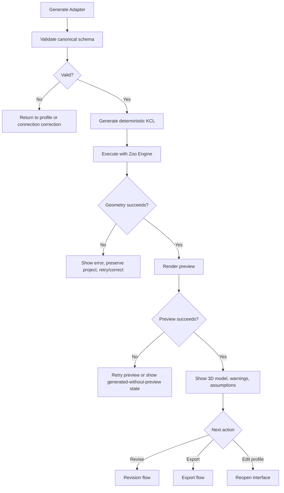

---

## UF-007: Revise the Adapter Using Structured Controls

* **Actor:** Primary user
* **Goal:** Change adapter dimensions or manufacturing settings without restarting.
* **Preconditions:**
  - A generated model exists, or a valid connection configuration exists.
* **Trigger / entry point:**
  - User selects **Revise Parameters** from the result screen.
* **Happy path:**
  1. The system displays current editable parameters.
  2. The user changes one or more allowed values:
     - length;
     - offset;
     - angle;
     - wall thickness;
     - Interface A clearance;
     - Interface B clearance.
  3. The system validates changes immediately.
  4. The system marks the existing model as **Out of date**.
  5. The user selects **Regenerate**.
  6. The system saves a new schema version.
  7. Generation runs.
  8. The new model replaces the current result after success.
  9. The system shows a summary of changed values.
* **Alternative paths:**
  - User selects **Reset to Last Generated Values**.
  - User returns without applying changes.
  - `Optional:` Compare old and new result.
* **Validation errors:**
  - Same connection/manufacturing errors as UF-005.
  - Invalid text/non-numeric input.
  - Value outside supported range.
  - Conflicting values.
  - Regeneration remains disabled until critical errors are resolved.
* **Permission/auth errors:**
  - No user authentication.
  - Zoo service unavailable:
    - allow editing;
    - disable regeneration with explanation;
    - preserve draft values.
* **System failures and recovery:**
  - New generation fails:
    - keep previous successful model as last known good;
    - mark new revision failed;
    - allow editing/retry;
    - do not delete prior exports.
  - Save fails:
    - preserve field values in current browser state;
    - retry.
* **Cancellation / exit behavior:**
  - User may discard draft changes and return to current model.
  - If leaving with unsaved changes, show confirmation.
* **Postconditions:**
  - On success, a new schema/model version is current.
  - On cancellation or failure, the previous successful model remains available.
* **Required UI states:**
  - **Default:** Current values editable.
  - **Loading:** Validation/regeneration.
  - **Empty:** Not applicable.
  - **Success:** New model with change summary.
  - **Error:** Invalid parameters or failed regeneration.
  - **Unauthorized:** Generation unavailable due to service credentials.
* **Accessibility notes:**
  - Inputs require labels, units, valid ranges, and error associations.
  - Change summary must be textual.
  - Reset action must not occur without confirmation if multiple changes exist.
* **Assumptions / open questions:**
  - `Assumption:` Last successful model remains available after failed revision.
  - `TBD:` Number of versions retained.
  - `TBD:` Before/after visual comparison.

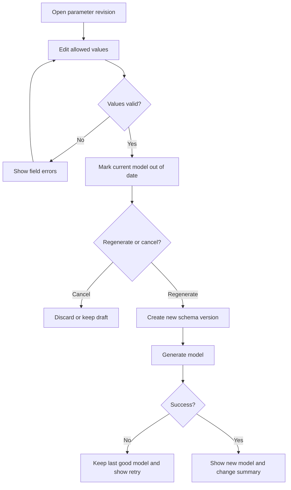

---

## UF-008: Revise the Adapter Using Natural Language

* **Actor:** Primary user
* **Goal:** Request a simple design change without understanding parameter names.
* **Preconditions:**
  - A valid generated model or configured project exists.
  - Agent API is available.
  - The requested change can map to allowlisted parameters.
* **Trigger / entry point:**
  - User selects **Describe a Change**.
* **Happy path:**
  1. The system shows a prompt field and examples:
     - “Make the vacuum side 0.5 mm looser.”
     - “Increase the transition length by 20 mm.”
     - “Reduce the angle to 25 degrees.”
  2. The user enters a request.
  3. The system submits it for structured interpretation.
  4. The Agent API returns:
     - proposed parameter changes;
     - explanation;
     - whether confirmation is required.
  5. The application validates all proposed changes against an allowlist and geometry rules.
  6. The system shows a confirmation summary:
     - old value;
     - proposed value;
     - expected effect.
  7. The user approves.
  8. The system applies the parameter patch to a new schema version.
  9. The adapter regenerates.
  10. The system shows the updated model and change summary.
* **Alternative paths:**
  - Request is ambiguous:
    - system asks one clarification question;
    - user answers;
    - interpretation repeats.
  - Request includes unsupported geometry:
    - system explains what can be changed through the MVP;
    - offers relevant parameter controls.
  - User edits the proposed values manually before approval.
* **Validation errors:**
  - Empty prompt.
  - Prompt too long (`TBD` limit).
  - No recognized parameter change.
  - Proposed value outside allowed range.
  - Request attempts to alter approved profile geometry in an unsupported way.
  - Agent response is malformed or contains non-allowlisted fields.
* **Permission/auth errors:**
  - No user authentication.
  - Agent API credentials unavailable:
    - show natural-language revision unavailable;
    - link to structured parameter revision instead.
* **System failures and recovery:**
  - Agent timeout:
    - preserve prompt;
    - offer retry;
    - allow switching to manual controls.
  - Invalid Agent response:
    - do not apply changes;
    - show safe failure;
    - log raw technical response securely.
  - Regeneration failure:
    - preserve previous successful model;
    - keep proposed parameter patch for editing/retry.
* **Cancellation / exit behavior:**
  - User can cancel before approval with no changes.
  - User can cancel during clarification.
  - Once regeneration begins, use UF-006 cancellation behavior.
* **Postconditions:**
  - On success, a validated natural-language change is reflected in a new model version.
  - Unsupported or failed requests do not alter the current model.
* **Required UI states:**
  - **Default:** Prompt input and examples.
  - **Loading:** Interpreting request or regenerating.
  - **Empty:** No request entered.
  - **Success:** Proposed patch confirmed and model updated.
  - **Error:** Ambiguous, unsupported, malformed, or failed request.
  - **Unauthorized:** Agent service unavailable.
* **Accessibility notes:**
  - Example prompts must be selectable text, not placeholder-only.
  - Proposed changes must be listed in a table or structured text.
  - Confirmation must clearly distinguish current and proposed values.
  - Clarification questions require focus management.
* **Assumptions / open questions:**
  - `Assumption:` One clarification turn is sufficient for MVP.
  - `TBD:` Prompt length and rate limits.
  - `TBD:` Whether profile-dimension edits are allowlisted or only connection/manufacturing parameters.
  - `Assumption:` Agent output is always validated before use.

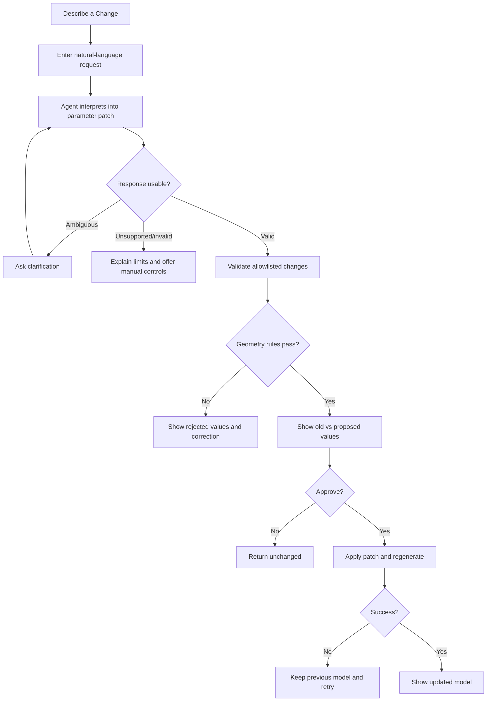

---

## UF-009: Export STL and KCL

* **Actor:** Primary user
* **Goal:** Download the current adapter in useful manufacturing and editable formats.
* **Preconditions:**
  - A successful current model exists.
  - The model corresponds to the latest approved schema.
  - No critical export-blocking warning exists.
* **Trigger / entry point:**
  - User selects **Export Files** from the result screen.
* **Happy path:**
  1. The system displays available formats:
     - STL — 3D printing;

     - KCL — parametric source.
  2. The system shows current units and key metadata.
  3. The user selects one or more formats.
  4. The system validates that the model is current.
  5. The system prepares or converts selected files using the appropriate Zoo capability.
  6. The system verifies that each requested artifact exists and is non-empty.
  7. The system presents download buttons.
  8. The user downloads the files.
  9. The system shows export success and recommended next step:
     - inspect in slicer for STL;

     - retain KCL for parametric editing.
* **Alternative paths:**
  - User downloads one format at a time.
  - User returns to revise before exporting.
  - Model volume or material estimate is displayed if reliable.
  - `Optional:` Download canonical design JSON.
* **Validation errors:**
  - Model is stale because an interface or parameter changed.
  - Current model has unresolved critical warnings.
  - Unsupported export format combination.
  - Export artifact missing or zero bytes.
  - User must regenerate before exporting a stale model.
* **Permission/auth errors:**
  - No user authentication.
  - File Format API credential failure:
    - explain export service unavailable;
    - preserve model;
    - allow retry.
* **System failures and recovery:**
  - One format fails while others succeed:
    - show per-format status;
    - allow download of successful files;
    - offer retry only for failed format.
  - Download link expires:
    - regenerate link without rerunning geometry where possible.
  - Browser blocks download:
    - explain how to allow it;
    - provide separate download buttons rather than forced pop-ups.
* **Cancellation / exit behavior:**
  - User may close export dialog without losing model.
  - Cancelling file preparation does not delete the model.
* **Postconditions:**
  - Selected artifacts are available to the user.
  - Export status is logged.
  - Model remains available for further revision in the current session.
* **Required UI states:**
  - **Default:** Format selection and explanations.
  - **Loading:** Preparing/converting files.
  - **Empty:** No formats selected.
  - **Success:** Per-format download links.
  - **Error:** Per-format failure or stale model.
  - **Unauthorized:** Export service credentials unavailable.
* **Accessibility notes:**
  - Format descriptions must explain intended use.
  - Per-format progress and status must be announced.
  - Download buttons must include filename/format in accessible name.
  - Avoid automatic multi-file pop-ups.
* **Assumptions / open questions:**
  - `TBD:` Whether formats are generated together or independently.
  - `TBD:` File naming convention.
  - `TBD:` Link lifetime.
  - `TBD:` Whether the KCL source is generated before Engine execution or downloaded from a stored artifact.
  - `Assumption:` A stale model cannot be exported as current.

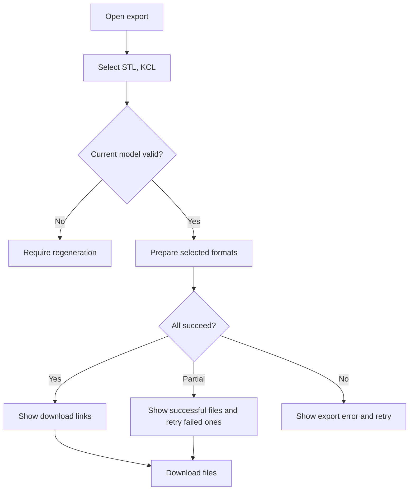

---

## UF-010: Recover from a Poor or Unusable Source Image

* **Actor:** Primary user
* **Goal:** Understand why an image cannot be used and provide a better input.
* **Preconditions:**
  - User uploaded an image.
  - Image-quality or profile-extraction confidence is below the acceptable threshold.
* **Trigger / entry point:**
  - Upload validation or profile interpretation rejects the image.
* **Happy path:**
  1. The system shows the rejected image.
  2. The system explains the specific issue:
     - perspective angle;
     - cropped contour;
     - low contrast;
     - reflection/shadow;
     - insufficient resolution;
     - profile not isolated;
     - no usable scale/dimension.
  3. The system overlays or points to the problematic region where feasible.
  4. The system shows one relevant corrected example.
  5. The user selects **Retake or Upload Another Image**.
  6. The user submits a better image.
  7. The system re-runs validation.
  8. On success, navigate to profile review.
* **Alternative paths:**
  - User keeps the image and adds missing dimensions if the profile is recoverable.
  - User switches from photograph to hand sketch.
  - `TBD:` User manually chooses a basic profile type and enters dimensions without image interpretation.
* **Validation errors:**
  - Repeated unusable image.
  - Missing mandatory dimensions.
  - Unsupported multi-profile image.
* **Permission/auth errors:**
  - Camera permission denied if direct capture exists; file upload remains available.
  - No account authentication.
* **System failures and recovery:**
  - Quality analysis service fails:
    - distinguish service failure from bad image;
    - preserve file;
    - offer retry.
* **Cancellation / exit behavior:**
  - User may return to project start.
  - Warn about possible loss if session persistence is absent.
* **Postconditions:**
  - A better image is submitted, or the user leaves the flow without an approved interface.
* **Required UI states:**
  - **Default:** Rejection explanation.
  - **Loading:** Rechecking image.
  - **Empty:** Waiting for replacement.
  - **Success:** Image accepted.
  - **Error:** Repeated rejection or service failure.
  - **Unauthorized:** Camera permission or analysis service issue.
* **Accessibility notes:**
  - Do not rely only on visual overlays; provide text explanation.
  - Bad/good examples need alt text.
  - Replacement controls must be keyboard accessible.
* **Assumptions / open questions:**
  - `TBD:` Whether manual basic-shape entry is available as fallback.
  - `TBD:` Confidence threshold and retry limits.
  - `Assumption:` The system rejects rather than guesses when confidence is too low.

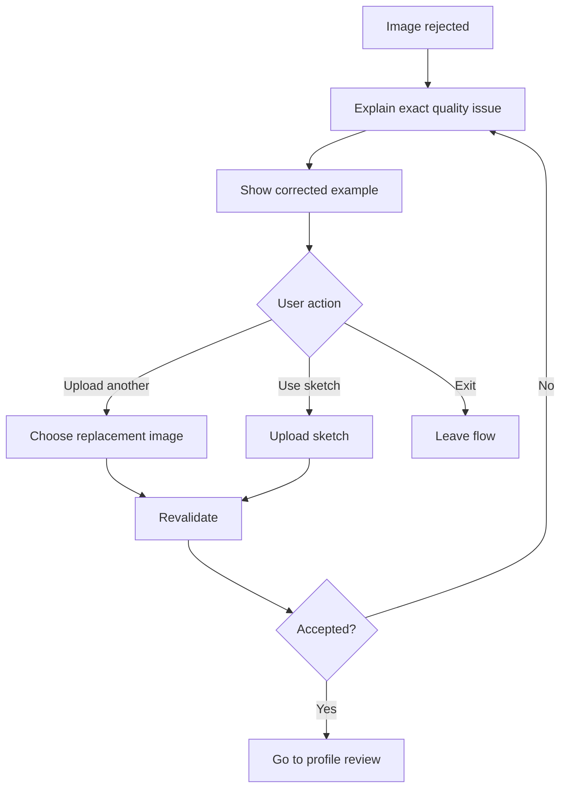

---

## UF-011: Handle a Generation or Export Service Outage

* **Actor:** Primary user
* **Goal:** Preserve work and understand how to continue when Zoo or another required service is unavailable.
* **Preconditions:**
  - User has made progress in a project.
  - A remote service call is required.
* **Trigger / entry point:**
  - Engine, Agent, vision, or File Format service returns an availability, credential, quota, or network error.
* **Happy path:**
  1. The system detects the failed service and classifies the failure.
  2. The system shows:
     - which action failed;
     - whether project data is safe;
     - whether retry is appropriate;
     - an internal error ID.
  3. The system preserves all user-approved profiles and parameters in the active session.
  4. The user selects **Retry**.
  5. The system retries only the failed operation where safe.
  6. On success, the user returns to the interrupted flow.
* **Alternative paths:**
  - User selects **Continue Editing** if the unavailable service is not needed for editing.
  - User selects **Return Later**.
  - User switches from natural-language revision to structured controls when only Agent API is unavailable.
* **Validation errors:**
  - Not applicable; this flow handles system/service errors.
* **Permission/auth errors:**
  - Zoo/AI credential rejected.
  - API quota exhausted.
  - The user must not be asked to enter developer API keys.
  - Show a product-level service notice.
* **System failures and recovery:**
  - Retry repeatedly fails:
    - stop automatic retries;
    - preserve project;
    - provide a clear status and next step.
  - Session cannot be persisted:
    - warn user before leaving;
    - `TBD:` allow design JSON download as emergency recovery.
* **Cancellation / exit behavior:**
  - User may cancel retry and continue editing available fields.
  - User may leave after a warning about persistence.
* **Postconditions:**
  - Successful retry resumes the original flow.
  - Otherwise, user work remains preserved to the extent supported by session storage.
* **Required UI states:**
  - **Default:** Service interruption notice.
  - **Loading:** Retry in progress.
  - **Empty:** Not applicable.
  - **Success:** Resume interrupted flow.
  - **Error:** Service remains unavailable.
  - **Unauthorized:** Explicit credential/quota state presented as product service unavailability.
* **Accessibility notes:**
  - Service status must be announced without trapping focus.
  - Retry buttons must identify the operation.
  - Avoid indefinite spinners; show timeout and next action.
* **Assumptions / open questions:**
  - `TBD:` Local/session persistence implementation.
  - `TBD:` Emergency design JSON download.
  - `Assumption:` The app can distinguish credential/quota failures from user input failures.

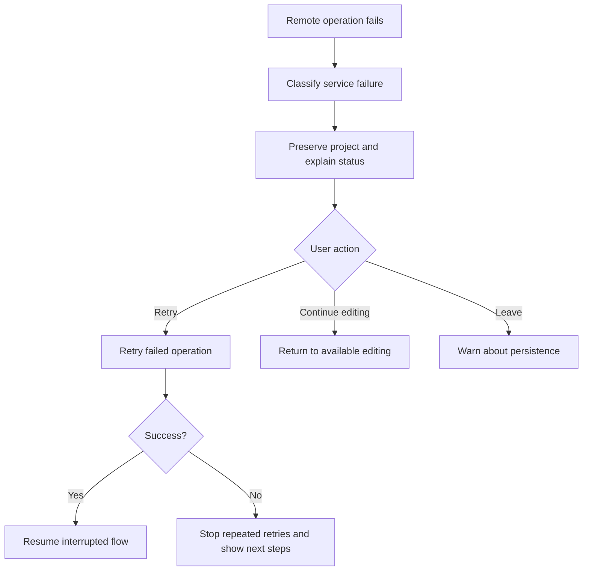

---

## UF-012: Exit, Resume, or Restart a Project

* **Actor:** Primary user
* **Goal:** Leave the workflow safely and understand whether progress can be resumed.
* **Preconditions:**
  - A temporary project exists.
* **Trigger / entry point:**
  - User navigates away, closes the tab, refreshes, or selects **Exit Project**.
* **Happy path:**
  1. The system checks for unsaved or in-progress work.
  2. If no unsaved work exists, exit immediately.
  3. If unsaved work exists, show:
     - **Stay and Continue**;
     - **Discard and Exit**;
     - **Save for This Browser** only if local persistence is implemented.
  4. User selects an action.
  5. The system follows the selected behavior.
* **Alternative paths:**
  - User chooses **Start Over**:
    - system requests confirmation;
    - clears current temporary project;
    - returns to project start.
  - User refreshes:
    - restore local project if available;
    - otherwise show a clear restart message.
* **Validation errors:**
  - Not applicable.
* **Permission/auth errors:**
  - No user authentication.
  - Browser storage unavailable:
    - explain that resume cannot be guaranteed.
* **System failures and recovery:**
  - Local save fails:
    - keep user on current page;
    - offer retry or emergency design JSON download if implemented.
  - Restore fails:
    - do not partially merge corrupt data;
    - offer restart and log error.
* **Cancellation / exit behavior:**
  - This is the cancellation/exit flow.
* **Postconditions:**
  - User stays, exits with data discarded, or exits with resumable local data.
* **Required UI states:**
  - **Default:** Exit confirmation.
  - **Loading:** Saving/restoring.
  - **Empty:** No resumable project found.
  - **Success:** Saved and exited, restored, or discarded.
  - **Error:** Save/restore failure.
  - **Unauthorized:** Browser storage permission/restriction; no account state.
* **Accessibility notes:**
  - Confirmation dialog must trap focus correctly and return focus on cancel.
  - Buttons must clearly describe data consequences.
  - Do not rely solely on browser-native unload warnings.
* **Assumptions / open questions:**
  - **PRD conflict:** Local project persistence is optional, but reliable exit/resume behavior depends on it.
  - `TBD:` Whether MVP implements local browser persistence.
  - `TBD:` Whether design JSON emergency export is included.
  - `Assumption:` No cloud resume because accounts and cloud storage are out of scope.

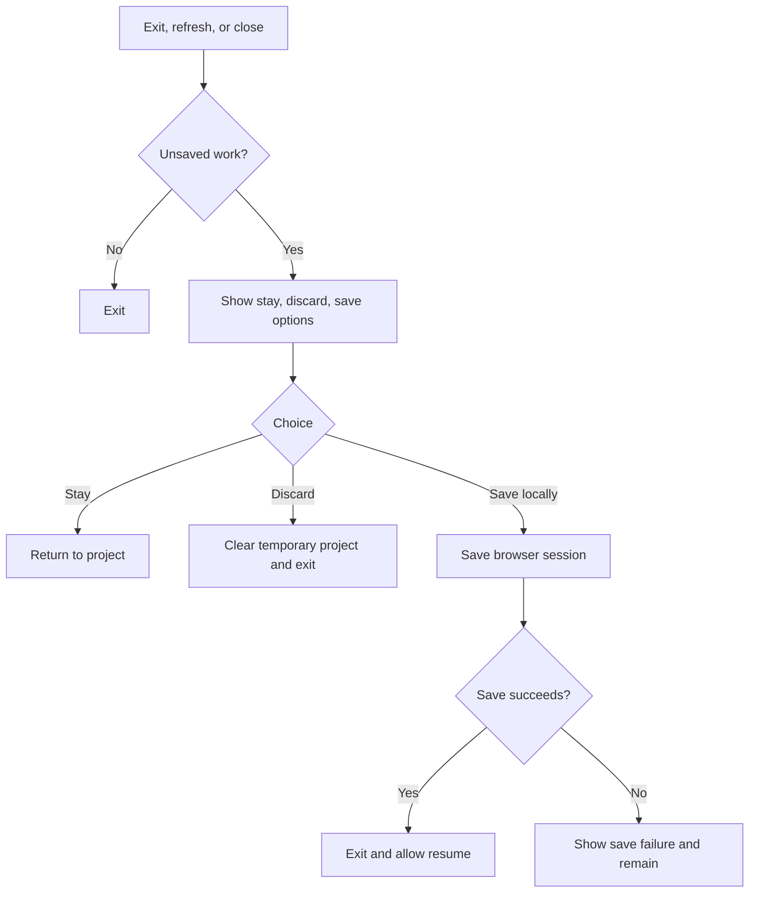

---

# 2. Navigation Model

Recommended linear navigation:

```text
Landing
  → Interface A Upload
  → Interface A Review
  → Interface B Upload
  → Interface B Review
  → Connection Selection
  → Connection Configuration
  → Generation
  → Result
      ↳ Structured Revision
      ↳ Natural-Language Revision
      ↳ Edit Interface A/B
      ↳ Export
```

### Navigation rules

- Users may move backward to completed steps.
- Moving backward and changing approved data invalidates downstream results.
- Users may not skip profile approval.
- Users may not export stale or failed geometry.
- The current step and completion status must remain visible.
- Direct URL access to later steps without required project state redirects to the earliest incomplete step.
- Because no user account exists, invalid or expired session links redirect to the landing page with an explanation.

---

# 3. Cross-Flow State Model

Suggested project states:

```text
new
interface_a_uploaded
interface_a_review_required
interface_a_approved
interface_b_uploaded
interface_b_review_required
interfaces_approved
connection_configured
generation_in_progress
generation_failed
model_current
model_stale
revision_draft
export_in_progress
export_ready
```

### State rules

- `interfaces_approved` requires A and B approval.
- `connection_configured` requires valid approved profiles.
- `model_current` requires successful generation against the latest schema version.
- Editing an interface or parameter changes `model_current` to `model_stale`.
- Export requires `model_current`.
- A failed revision must not destroy the previous `model_current` artifact.
- `TBD:` Whether the state model is persisted locally.

---

# 4. Global Empty, Loading, Error, and Unauthorized Behavior

## Empty

Every empty state must:

- explain what is missing;
- state why it is needed;
- provide one clear next action.

## Loading

Every remote operation must:

- identify the current stage;
- avoid indefinite unlabelled spinners;
- preserve user inputs;
- provide cancel or retry where feasible.

## Error

Every user-facing error must include:

- what happened;
- whether user data is safe;
- what the user can do next;
- internal error ID for support/debugging.

## Unauthorized

Because end-user authentication is out of scope:

- never redirect to a login screen;
- never ask the user for Zoo or AI developer credentials;
- represent API credential/quota failures as service unavailability;
- preserve work and offer retry or a supported alternate path.

---

# 5. Open UX Decisions Requiring Product Approval

1. Whether local browser persistence is promoted from optional to required.
2. Whether users may manually choose a basic profile and bypass image recognition.
3. Whether one low-confidence inferred dimension can be approved with acknowledgment.
4. Exact controls available for traced closed profiles.
5. Whether the 3D preview is interactive or snapshot-based.
6. Exact supported angle, offset, clearance, and wall-thickness limits.
7. Whether fit presets are required or optional.
8. Whether a failed revision retains only the last model or multiple model versions.
9. Whether design JSON download is included as a recovery/export option.
10. Whether camera capture is supported directly in the browser.
